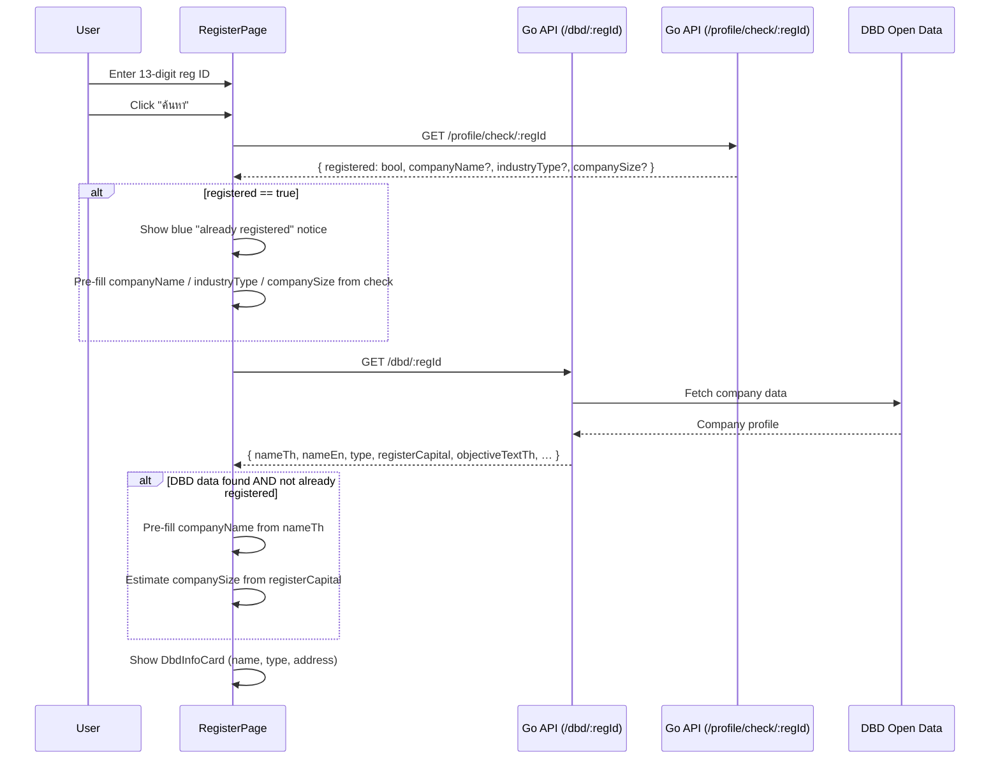
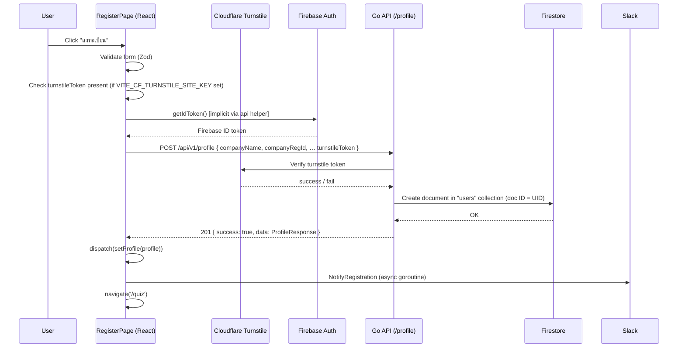
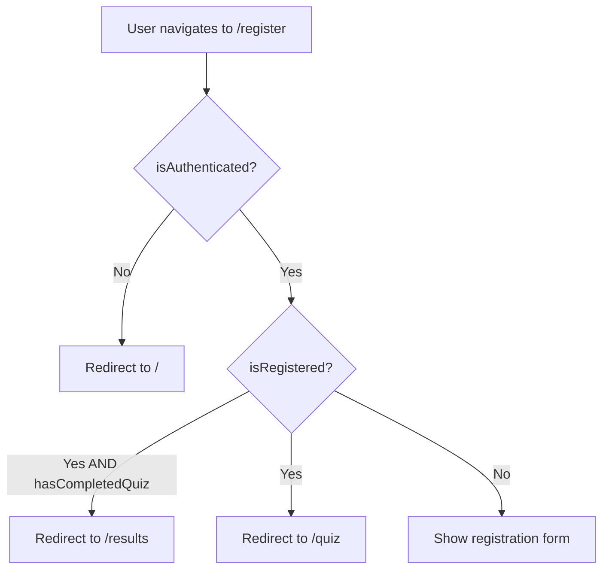

# Company Registration — Feature Spec

> One-time onboarding form that creates a user profile after Google Sign-In,
> linking a verified Firebase user to a company and allowing them to proceed to
> the factory health-check quiz.

---

## 1. Summary

After a user signs in with Google they have no profile. Without a profile the
app redirects them to `/register`. Here the user submits company and contact
details; the backend creates a Firestore profile document and responds with the
full profile. The frontend stores the profile in Redux and navigates to `/quiz`.

Two assistive features reduce friction:

- **DBD lookup** — entering a 13-digit company registration ID and clicking
  "ค้นหา" auto-fills the company name and estimated size from the DBD Open Data
  API via the backend.
- **Existing-registration notice** — if the same registration ID was already
  used by another user, the form is pre-filled with their company name and a
  blue notice is shown so the user understands their data will be linked to that
  company record.

Bot protection is provided by Cloudflare Turnstile (configurable via
`VITE_CF_TURNSTILE_SITE_KEY`; if the key is absent, Turnstile is skipped).

---

## 2. Goals & Non-Goals

### Goals

- Collect the minimum company data required to run the Shindan assessment.
- Auto-fill from the DBD API to reduce manual typing for factory operators.
- Validate the 13-digit registration ID format client- and server-side.
- Prevent duplicate registrations (same `companyRegId` creates a second profile
  for a different Firebase UID but links them to the same company context).
- Protect the endpoint against bots with Cloudflare Turnstile.
- Capture PDPA consent (terms + privacy) and optional marketing consent.
- Notify the #registrations Slack channel on every new sign-up.
- TH/EN bilingual — all copy goes through `useLocale()`.

### Non-Goals

- Email verification (Firebase/Google handles identity).
- In-form company search by name (registration ID is the lookup key).
- Self-service account deletion (admin operation only).
- Multi-step wizard; the form is a single scrollable page.

---

## 3. Current State

| Component | Location | Status |
|-----------|----------|--------|
| Registration page | `apps/web-app/src/pages/RegisterPage.tsx` | ✅ Built |
| Form schema (Zod) | `RegisterPage.tsx` — `schema` const | ✅ Built |
| DBD lookup | `GET /api/v1/dbd/:regId` via `handleDbdLookup` | ✅ Built |
| Duplicate-ID check | `GET /api/v1/profile/check/:regId` | ✅ Built |
| Backend handler | `apps/backend/services/profile/handler.go` | ✅ Built |
| Backend service | `apps/backend/services/profile/service.go` | ✅ Built |
| Profile model | `apps/backend/services/profile/models.go` | ✅ Built |
| Slack notification | `NotifyRegistration()` via `NotificationService` | ✅ Built |
| Turnstile widget | `apps/web-app/src/components/Turnstile.tsx` | ✅ Built |
| Legal modals | `apps/web-app/src/components/LegalModal.tsx` | ✅ Built |
| Auth panel (right column) | `apps/web-app/src/components/AuthPanel.tsx` | ✅ Built |
| Analytics events | `registration_submit`, `registration_success`, `registration_error` | ✅ Built |
| Route guard | Redirects `/register` → `/quiz` if `isRegistered` | ✅ Built |

---

## 4. Form Fields

### Company section

| Field | i18n key | Type | Validation |
|-------|----------|------|------------|
| Company registration ID | `register.regId` | `string` | Required · exactly 13 digits (`/^\d{13}$/`) |
| Company name | `register.companyName` | `string` | Required · min 1 char |
| Industry type | `register.industryType` | enum select | Required · one of 16 values (see §4.1) |
| Company size | `register.companySize` | enum select | Required · `small` / `medium` / `large` |

### Contact section

| Field | i18n key | Type | Validation |
|-------|----------|------|------------|
| Contact name | `register.contactName` | `string` | Required · min 1 char |
| Contact email | `register.contactEmail` | `string` | Required · valid email — pre-filled from Firebase, **disabled** |
| Contact phone | `register.contactPhone` | `string` | Required · min 9 chars |

### Consent section

| Field | i18n key | Type | Validation |
|-------|----------|------|------------|
| Accept terms & privacy | `register.acceptTerms` | checkbox | Must be `true` (blocking) |
| Marketing consent | `register.marketingConsent` | checkbox | Optional boolean |

#### 4.1 Industry type values

`manufacturing`, `food`, `automotive`, `electronics`, `textile`, `chemical`,
`construction`, `agriculture`, `logistics`, `energy`, `pharma`, `plastics`,
`printing`, `metal`, `wood`, `other`

#### 4.2 Company size mapping (from DBD register capital)

| Register capital | Inferred size |
|-----------------|--------------|
| < 5,000,000 THB | `small` |
| 5,000,000 – 199,999,999 THB | `medium` |
| ≥ 200,000,000 THB | `large` |

Applied automatically when DBD lookup succeeds; the user can override.

---

## 5. DBD Lookup Flow



**Button state:** "ค้นหา" is disabled while loading or after a successful lookup.
The label transitions: idle → `register.lookup`, loading → `register.lookupLoading`,
found → `register.lookupFound`. Changing the reg ID input resets both
`dbdInfo` and `regIdTaken`, re-enabling the button.

---

## 6. Registration Submit Flow



---

## 7. Route Guard Logic



These guards are applied synchronously at the top of `RegisterPage` before any
form is rendered. The Redux `auth` slice provides `isRegistered` and
`hasCompletedQuiz`.

---

## 8. Backend API

### POST `/api/v1/profile` — Create profile

**Auth:** Firebase ID token (Bearer)

**Request body**

```jsonc
{
  "companyName":    "บริษัท ตัวอย่าง จำกัด",  // required, 2–200 chars
  "companyRegId":   "0115560016313",            // required, 13 digits
  "industryType":   "manufacturing",            // required, see §4.1
  "companySize":    "medium",                   // required, small|medium|large
  "contactName":    "สมชาย ใจดี",               // required, 2–100 chars
  "contactEmail":   "somchai@example.com",      // required, valid email
  "contactPhone":   "0812345678",               // required
  "turnstileToken": "<cf-token>",               // required (or "skip-for-now" if key absent)
  "consentVersion": "1.0"                       // optional
}
```

**Success — 201**

```jsonc
{
  "success": true,
  "data": {
    "uid": "firebase-uid",
    "email": "somchai@example.com",
    "displayName": "Somchai Jaidee",
    "companyName": "บริษัท ตัวอย่าง จำกัด",
    "companyRegId": "0115560016313",
    "industryType": "manufacturing",
    "companySize": "medium",
    "contactName": "สมชาย ใจดี",
    "contactEmail": "somchai@example.com",
    "contactPhone": "0812345678",
    "role": "user",
    "consentVersion": "1.0",
    "emailNotifications": false,
    "createdAt": "2026-06-10T09:00:00Z"
  }
}
```

**Errors**

| HTTP | Code | Condition |
|------|------|-----------|
| 400 | `VALIDATION_ERROR` | Missing / invalid field |
| 400 | `CAPTCHA_FAILED` | Turnstile verification failed |
| 401 | `UNAUTHORIZED` | Missing or invalid Firebase token |
| 409 | `CONFLICT` | UID already has a profile (`ErrAlreadyRegistered`) |

### GET `/api/v1/profile/check/:regId` — Check existing registration

**Auth:** Firebase ID token (Bearer)

Returns `{ registered: false }` if available, or
`{ registered: true, companyName, companyRegId, industryType, companySize }`
if taken. Used before the DBD lookup to detect duplicate registration IDs.

---

## 9. Firestore Document

Collection: `users` · Document ID: Firebase UID

| Field | Type | Source |
|-------|------|--------|
| `uid` | string | Firebase token |
| `email` | string | Firebase token |
| `displayName` | string | Firebase token |
| `companyName` | string | form |
| `companyRegId` | string | form |
| `industryType` | string | form |
| `companySize` | string | form |
| `contactName` | string | form |
| `contactEmail` | string | form |
| `contactPhone` | string | form |
| `role` | string | set to `"user"` by service |
| `consentVersion` | string | form (optional) |
| `consentAt` | string (ISO 8601) | set by service |
| `emailNotifications` | bool | defaults `false` |
| `createdAt` | string (ISO 8601) | set by service |
| `updatedAt` | string (ISO 8601) | set by service |

---

## 10. UI Layout

```
┌──────────────────────────────────────────────────────────────┐
│  Card (max-w-3xl, shadow-lg)                                 │
│  ┌───────────────────────────┬────────────────────────────┐  │
│  │  Left: Form (p-8/p-10)   │  Right: AuthPanel          │  │
│  │  ┌─────────────────────┐ │  (hidden on mobile,        │  │
│  │  │  Icon + Title       │ │   brand / sign-out info)   │  │
│  │  │  Subtitle           │ │                            │  │
│  │  └─────────────────────┘ │                            │  │
│  │  [companyRegId] [ค้นหา]  │                            │  │
│  │  [blue notice if taken]   │                            │  │
│  │  [DbdInfoCard if found]   │                            │  │
│  │  [companyName]            │                            │  │
│  │  [industryType] [size]    │                            │  │
│  │  ── Contact ──────────── │                            │  │
│  │  [contactName]            │                            │  │
│  │  [contactEmail][phone]    │                            │  │
│  │  ☑ Accept terms & privacy │                            │  │
│  │  ☐ Marketing consent      │                            │  │
│  │  [Turnstile widget]       │                            │  │
│  │  [Error banner]           │                            │  │
│  │  [ลงทะเบียน btn]          │                            │  │
│  └───────────────────────────┴────────────────────────────┘  │
└──────────────────────────────────────────────────────────────┘
```

The contact email field is **pre-filled from Firebase** and is disabled
(`cursor-not-allowed`, `bg-muted/40`). The AuthPanel (right column) is hidden
on mobile (`md:grid-cols-2` only activates at ≥ md breakpoint).

---

## 11. Analytics Events

| Event | Trigger | Properties |
|-------|---------|------------|
| `registration_submit` | Form submit starts | `industry`, `size` |
| `registration_success` | 201 response received | `industry`, `size` |
| `registration_error` | API error or Turnstile fail | `error` (message string) |

---

## 12. Error States

| Scenario | UX |
|----------|----|
| Invalid reg ID format | Red helper text under the field |
| Turnstile token missing | Inline red banner: "กรุณายืนยัน captcha" |
| API 409 (already registered) | Inline red banner with server message |
| API 5xx | Inline red banner: generic `register.error` i18n string |
| DBD lookup fails | Silent failure — user fills fields manually |
| Reg ID already used by another user | Blue notice, form pre-filled; registration still proceeds |

---

## 13. Acceptance Criteria

- [ ] Unauthenticated users who navigate to `/register` are redirected to `/`.
- [ ] Already-registered users are redirected to `/quiz` (or `/results` if quiz done).
- [ ] Entering a valid 13-digit reg ID and clicking ค้นหา fetches company info from DBD and pre-fills company name and estimated size.
- [ ] If the reg ID is already in use, a blue notice is shown and the form is pre-filled with the existing company data; the user can still complete registration.
- [ ] All required fields show validation errors when submitted empty.
- [ ] The 13-digit reg ID field rejects non-numeric and <13 or >13 digit values.
- [ ] Contact email is pre-filled from Firebase and cannot be edited.
- [ ] Accepting terms is mandatory — the form cannot be submitted without checking the box.
- [ ] Marketing consent is optional and defaults unchecked.
- [ ] When `VITE_CF_TURNSTILE_SITE_KEY` is set, the Turnstile widget is rendered and the form cannot be submitted without a valid token.
- [ ] A successful submission dispatches `setProfile` to Redux, navigates to `/quiz`, and fires `registration_success`.
- [ ] A Slack notification is sent to #registrations after every successful registration.
- [ ] All copy is rendered in the active locale (TH/EN) — no hardcoded strings.
- [ ] `make lint-web` and `make test-web` pass.

---

## 14. Testing

- **Unit (Vitest):** `estimateCompanySize` edge cases (zero, boundary values); Zod schema accepts valid and rejects invalid payloads.
- **Integration (handler_test.go):** `POST /profile` → 201 with valid payload; 409 on duplicate UID; 400 on missing fields; Turnstile failure path.
- **E2E (Playwright):**
  - Happy path: sign in → `/register` → fill form → submit → land on `/quiz`.
  - DBD prefill: enter reg ID → click ค้นหา → assert companyName / companySize filled.
  - Validation: submit empty form → assert all error messages appear.
  - Already-registered guard: authenticated + registered user navigates to `/register` → redirected to `/quiz`.

---

## 15. References

- Page: [RegisterPage.tsx](../../../apps/web-app/src/pages/RegisterPage.tsx)
- Backend handler: [handler.go](../../../apps/backend/services/profile/handler.go)
- Backend service: [service.go](../../../apps/backend/services/profile/service.go)
- Models: [models.go](../../../apps/backend/services/profile/models.go)
- Auth panel: [AuthPanel.tsx](../../../apps/web-app/src/components/AuthPanel.tsx)
- Legal modal: [LegalModal.tsx](../../../apps/web-app/src/components/LegalModal.tsx)
- Turnstile: [Turnstile.tsx](../../../apps/web-app/src/components/Turnstile.tsx)
- User flow: [user-flow.md](../user-flow.md)

---

*Version: 1.0.0*
*Last updated: 3 July 2026*
