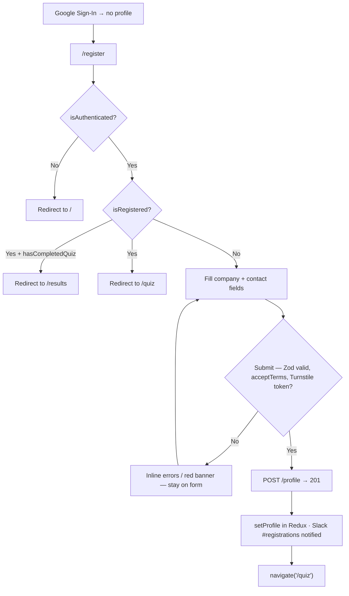
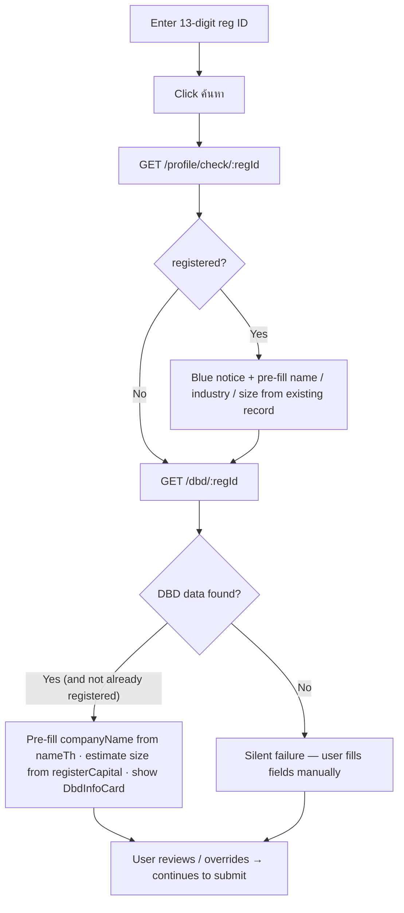

# Company Registration — User Journeys

How each app's users move through registration. See [README.md](./README.md) for the
design spec and [feature-spec.md](./feature-spec.md) for the formal requirements.

> Reflects what is **built today** — all journeys below are fully shipped; there are no
> roadmap steps in this feature.

---

## Table of Contents

- [Factory operator — first-time registration](#factory-operator--first-time-registration)
- [Factory operator — DBD lookup inside the form](#factory-operator--dbd-lookup-inside-the-form)

---

## Factory operator — first-time registration

A newly signed-in operator with no profile is routed to `/register`; the form gates on
Terms + Privacy consent and Turnstile before creating the Firestore profile.

**Guard(s):** route guard runs synchronously at the top of `RegisterPage` (Redux `auth`
slice: `isRegistered`, `hasCompletedQuiz`); the backend takes the UID from
`middleware.GetUID(r)` and returns `409` if the UID already has a profile. Detail in
[registration-form.md](./registration-form.md).

---

## Factory operator — DBD lookup inside the form

Within the form, entering a 13-digit registration ID and clicking "ค้นหา" auto-fills
company data — and warns when the ID is already registered by another user.

**Guard(s):** both endpoints require a Bearer Firebase token. Changing the reg ID input
resets `dbdInfo` and `regIdTaken`, re-enabling the button. Detail in
[dbd-lookup.md](./dbd-lookup.md).

---

*See [README.md](./README.md) for the feature spec.*

---

*Version: 1.0.0*
*Last updated: 3 July 2026*
