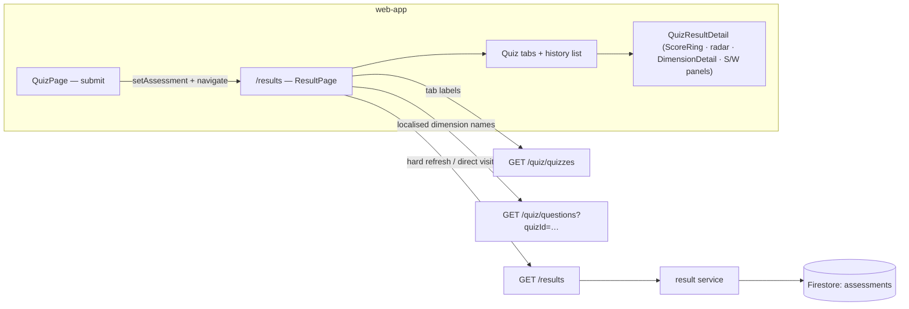

# Assessment Result — Feature Spec

**Status:** ✅ Shipped — multi-quiz results page live: score ring, radar chart, dimension detail, history.

---

## Table of Contents

1. [App surfaces](#app-surfaces)
2. [Summary](#summary)
3. [Goals & Non-Goals](#goals--non-goals)
4. [Current State](#current-state)
5. [Design Overview](#design-overview)
6. [Security Invariants](#security-invariants)
7. [Acceptance Criteria](#acceptance-criteria)
8. [Testing](#testing)
9. [Open Items & Future Work](#open-items--future-work)
10. [References](#references)

---

> Post-quiz results page at `/results` showing the computed assessment: overall score as a
> ring, diagnosis badge, radar chart, expandable per-dimension breakdown,
> strengths/weaknesses panels and a history list. Supports multiple quiz variants as tabs
> and switching between past assessments. Touches the `result` backend service (user-scoped
> reads from the `assessments` collection); the scoring itself is computed at submit time by
> the quiz/scoring features. Primary actor: the factory operator reviewing their diagnosis.

This README is the design index for the Assessment Result feature. The formal requirements
live in the ISO 29110 SRS — see [feature-spec.md](./feature-spec.md). Each non-trivial
component is documented in a dedicated sub-document; see [References](#references).

---

## App surfaces

| web-app | backend |
|:-------:|:-------:|
| ✅ | ✅ |

`web-app` renders `/results` (tabs, detail view, history); the backend `result` service
serves the authenticated user's assessments. The backoffice all-platform results view is a
separate feature ([backoffice](../backoffice/feature-spec.md)). Per-app flows live in
[user-journeys.md](./user-journeys.md).

---

## Summary

| Component | Description |
|-----------|-------------|
| **`ResultPage`** (web-app) | Top-level page — fetch orchestration, quiz tabs, history selection, re-take flow — see [result-page.md](./result-page.md) |
| **`QuizResultDetail`** (web-app) | Full result layout for one assessment: hero score card, radar chart, dimension grid, strengths/weaknesses — see [quiz-result-detail.md](./quiz-result-detail.md) |
| **`ScoreRing`** (web-app) | SVG circular score indicator, arc ∝ `score / 5` — see [quiz-result-detail.md](./quiz-result-detail.md) |
| **`DimensionDetail`** (web-app) | Accordion row per dimension with progress bar + 1–5 level grid — see [quiz-result-detail.md](./quiz-result-detail.md) |
| **`resultSlice`** (web-app) | Redux state: `assessment`, `assessments`, `loading` — see [result-page.md](./result-page.md) |
| **Result service** (backend) | `GET /results` + `GET /results/{assessmentId}`, user-scoped Firestore query — see [result-service.md](./result-service.md) |

---

## Goals & Non-Goals

From [feature-spec.md § 2](./feature-spec.md#2-goals--non-goals):

### Goals

- Show overall score as a circular ring with a numeric label (score / 5.00).
- Show diagnosis badge with colour coding per level.
- Radar (spider) chart of all dimension scores for visual comparison.
- Per-dimension expandable row with progress bar and visual level grid.
- Strengths (≥ 3.50) and Weaknesses (< 2.50) panels.
- Multi-quiz tab navigation — one tab per available quiz variant.
- History list when more than one assessment exists for the same quiz.
- Re-take / start button for quiz variants with no result yet.
- Bilingual (TH/EN) — all labels, dimension names, diagnosis levels.
- Dark-mode aware radar chart colours.

### Non-Goals

- Comparing two assessments side-by-side.
- Sharing or exporting the result as PDF/image.
- Re-submitting to overwrite an existing result (each submission creates a new assessment document).
- Admin-level result view (that is in the Admin Dashboard feature).

---

## Current State

See [status.md](./status.md) for the per-component implementation checklist. Everything in
scope is shipped; no open build items.

---

## Design Overview

The page reuses the assessment already in Redux (set by `QuizPage` on submit) to avoid a
redundant API call; on hard refresh or a direct URL visit it fetches all results and shows
the most recent. Diagnosis badge colours, score-colour thresholds and the animation
sequence are specified in [feature-spec.md § 7 & 12](./feature-spec.md#7-diagnosis-visual-config).

### Data model

| Collection | Document ID | Key fields | Notes |
|------------|-------------|------------|-------|
| `assessments` | `<assessmentID>` (UUIDv4) | `uid` · `quizId` · `overallScore` · `diagnosis` · `strengths[]` · `weaknesses[]` · `scores[] {dimensionId, dimensionName, dimensionNameTh, score, maxScore}` · `submittedAt` | Query: `where uid == uid` + `orderBy submittedAt desc` — no pagination (≤ ~4 variants per user) |

### API contract

| Method | Path | Auth / Role | Purpose |
|--------|------|-------------|---------|
| `GET` | `/api/v1/results` | Bearer | All of the user's assessments, most recent first → `{"success": true, "data": [...], "count": N}` |
| `GET` | `/api/v1/results/{assessmentId}` | Bearer | One assessment, scoped to the caller — `404` if it belongs to another UID |

Full request/response shapes in [feature-spec.md § 10](./feature-spec.md#10-backend-api).

---

## Security Invariants

| Invariant | Where enforced |
|-----------|----------------|
| UID taken from `middleware.GetUID(r)`, never the request body/path | `services/result/handler.go` |
| List query filtered by `uid` — a user can only ever fetch their own assessments | `services/result/service.go` (Firestore `where uid ==`) |
| Single-result fetch returns `404` (`ErrResultNotFound`) when the assessment exists but belongs to another UID — no ownership leak | `services/result/service.go` |

---

## Acceptance Criteria

Verbatim from [feature-spec.md § 15](./feature-spec.md#15-acceptance-criteria); the spec
marks the feature Done, so all are ticked:

- [x] Navigating to `/results` immediately after quiz submission shows the just-submitted result without a loading spinner (uses Redux state).
- [x] Hard refresh on `/results` fetches all results from the API and shows the most recent.
- [x] Score ring renders with the correct filled arc for the overall score (e.g. 3.47/5 = ~69% arc).
- [x] Diagnosis badge colour matches the level (Beginning=red, Developing=amber, Established=blue, Advanced=emerald).
- [x] Radar chart plots all dimension scores on the correct axes.
- [x] Each dimension row expands on click to show the level grid and exact score.
- [x] Strengths panel is omitted when no dimension score is ≥ 3.50.
- [x] Weaknesses panel is omitted when no dimension score is < 2.50.
- [x] Tabs render for all available quizzes; tabs with no result are at 50% opacity.
- [x] Clicking an empty-state tab's "Start" button navigates to `/quiz` with the correct `quizId`.
- [x] History list appears only when the active quiz has more than one assessment.
- [x] Clicking a history row swaps the detail view without a network request.
- [x] Dimension names in the radar chart and S/W panels render in the active locale.
- [x] `GET /api/v1/results/{id}` returns 404 when the assessment belongs to a different user.
- [x] `make lint-web` and `make test-web` pass.

---

## Testing

From [feature-spec.md § 16](./feature-spec.md#16-testing):

| Suite | Target | Notes |
|-------|--------|-------|
| Unit (Vitest — resultSlice) | `setAssessment`, `setAssessments`, `setLoading` reducers | web-app |
| Unit (Vitest — scoring) | `getScoreColor` threshold boundaries; `diagnosisConfig` unknown-key fallback to `Beginning` | web-app |
| Integration (`service_test.go`) | `GetResult` → `ErrResultNotFound` for correct ID + wrong UID; `GetUserResults` → empty slice (not nil) for a new user | `services/result/` |
| E2E (Playwright) | Quiz → `/results` render (`result-summary`, `result-spider-chart`, `result-strengths-panel` testids) · hard-refresh render · empty-tab "Start" button | web-app |

Coverage target: critical `services/` ≥ 80% (`go test ./... -cover`).

---

## Open Items & Future Work

None — the feature is shipped; changes go through a new CR in
[docs/iso29110/change-request-log.md](../../iso29110/change-request-log.md). Explicit
non-goals (side-by-side comparison, PDF/image export) would be new CRs, not open items.

---

## References

### Sub-documents

| Doc | Covers |
|-----|--------|
| [feature-spec.md](./feature-spec.md) | ISO 29110 SRS — formal requirements, visual config, data flow |
| [status.md](./status.md) | Current implementation status per component |
| [user-journeys.md](./user-journeys.md) | Factory-operator result flows (submit · refresh · tabs/history) |
| [result-page.md](./result-page.md) | `ResultPage` orchestration, `resultSlice`, tab & history logic |
| [quiz-result-detail.md](./quiz-result-detail.md) | `QuizResultDetail` + `ScoreRing` + `DimensionDetail`, diagnosis visual config |
| [result-service.md](./result-service.md) | Backend result service — endpoints, Firestore query, sentinel errors |
| [mockups/app.md](./mockups/app.md) | ASCII wireframes — `/results` states (web-app) |

### Cross-references

- [Quiz](../quiz/feature-spec.md) — computes and stores the assessment this page displays
- [Backoffice](../backoffice/feature-spec.md) — all-platform results view for FactorySync staff (§4)
- [User flow](../user-flow.md) — app-wide navigation map
- [Architecture overview](../../architecture/overview.md) · [Database](../../architecture/database.md)

---

*Version: 1.0.0*
*Last updated: 3 July 2026*
