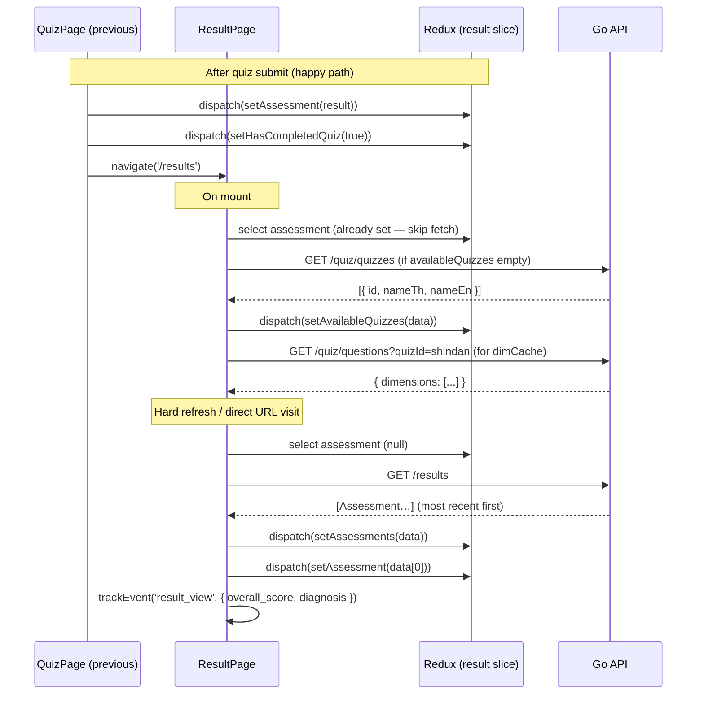

# Assessment Result — Feature Spec

> Post-quiz results page showing overall score, diagnosis badge, radar chart,
> per-dimension breakdown, strengths/weaknesses, and a history list. Supports
> multiple quiz variants as tabs and switching between past assessments.

---

## 1. Summary

`/results` is the destination after a successful quiz submission. It displays
the computed assessment in a structured, visual layout. All results for the
authenticated user are fetched and grouped by quiz variant — each variant
appears as a tab. Within a tab, if the user has taken the same quiz more than
once, a history list lets them switch between past assessments.

The page reuses the assessment already in Redux (set by `QuizPage` on submit)
to avoid a redundant API call on a fresh navigation. If no assessment is in
Redux (e.g. hard refresh or direct URL visit), it fetches all results from
the API and selects the most recent one.

---

## 2. Goals & Non-Goals

### Goals

- Show overall score as a circular ring with a numeric label (score / 5.00).
- Show diagnosis badge with colour coding per level.
- Radar (spider) chart of all dimension scores for visual comparison.
- Per-dimension expandable row with progress bar and visual level grid.
- Strengths (≥ 3.50) and Weaknesses (< 2.50) panels.
- Multi-quiz tab navigation — one tab per available quiz variant.
- History list when more than one assessment exists for the same quiz.
- Re-take / start button for quiz variants with no result yet.
- Bilingual (TH/EN) — all labels, dimension names, diagnosis levels.
- Dark-mode aware radar chart colours.

### Non-Goals

- Comparing two assessments side-by-side.
- Sharing or exporting the result as PDF/image.
- Re-submitting to overwrite an existing result (each submission creates a new assessment document).
- Admin-level result view (that is in the Admin Dashboard feature).

---

## 3. Current State

| Component | Location | Status |
|-----------|----------|--------|
| Result page | `apps/web-app/src/pages/ResultPage.tsx` | ✅ Built |
| Result Redux slice | `apps/web-app/src/store/resultSlice.ts` | ✅ Built |
| Backend handler | `apps/backend/services/result/handler.go` | ✅ Built |
| Backend service | `apps/backend/services/result/service.go` | ✅ Built |
| Result models | `apps/backend/services/result/models.go` | ✅ Built |
| Radar chart | `recharts` `RadarChart` inside `QuizResultDetail` | ✅ Built |
| Score ring | `ScoreRing` SVG component | ✅ Built |
| Dimension detail | `DimensionDetail` accordion component | ✅ Built |
| Animations | `framer-motion` via `@/components/motion` | ✅ Built |

---

## 4. UI Layout

```
┌─────────────────────────────────────────────────────────────┐
│  [Shindan] [Factory] [Cybersecurity] [Lean]   ← quiz tabs   │
│                                                             │
│  ┌─────────────────────────────────────────────────────┐    │
│  │  ● Score ring (148px)    Overall Score              │    │
│  │    3.47 / 5.00           [Established badge]        │    │
│  │                          2026-06-10                 │    │
│  └─────────────────────────────────────────────────────┘    │
│                                                             │
│  ┌─────────────────────────────────────────────────────┐    │
│  │  DIMENSION SCORES                                   │    │
│  │  [Radar / spider chart — 280px–320px]               │    │
│  └─────────────────────────────────────────────────────┘    │
│                                                             │
│  ┌─────────────────────────────────────────────────────┐    │
│  │  DIMENSION DETAIL  (2-column grid on md+)           │    │
│  │  ├─ Basic Management ──────────── 3.83 ▾           │    │
│  │  │    [expandable: level grid 1–5 + score bar]      │    │
│  │  ├─ Work Improvement ──────────── 3.25              │    │
│  │  └─ …                                               │    │
│  └─────────────────────────────────────────────────────┘    │
│                                                             │
│  ┌──────────────────┐  ┌──────────────────────────────┐     │
│  │  ✓ STRENGTHS     │  │  ! WEAKNESSES                │     │
│  │  + Quality Ctrl  │  │  ! Cost Control              │     │
│  └──────────────────┘  └──────────────────────────────┘     │
│                                                             │
│  ┌─────────────────────────────────────────────────────┐    │
│  │  PREVIOUS ASSESSMENTS  (only if > 1 result)         │    │
│  │  2026-05-01    3.12    [Established]                │    │
│  │  2026-03-15    2.87    [Developing]  ← selected     │    │
│  └─────────────────────────────────────────────────────┘    │
└─────────────────────────────────────────────────────────────┘
```

### Empty state (no result for a quiz tab)

When a tab has no assessment yet, the tab is rendered at 50% opacity and its
content shows a centred empty-state card with a "Start [quiz name]" button.
Clicking it dispatches `resetQuiz()` + `setQuizId(qid)` and navigates to
`/quiz`.

---

## 5. Component Breakdown

### `ScoreRing`

SVG circle with two concentric rings — background (`--border`) and filled arc
(`--primary`). Arc length is proportional to `score / 5`. Animated via
`transition-all duration-1000 ease-out`. Score text is absolutely positioned
in the centre.

### `DimensionDetail`

Accordion row. Header: dimension name, mono score, progress bar. Expanded
panel: a 5-cell level grid (cells highlight up to `Math.floor(score)`) with
"Beginning → Advanced" labels, plus exact score / maxScore.

### `QuizResultDetail`

Full result layout for one assessment:
1. Hero score card (`ScoreRing` + diagnosis badge + submitted date)
2. Radar chart (`recharts RadarChart`)
3. 2-column `DimensionDetail` grid
4. Strengths + Weaknesses panels (omitted if empty)

Dimension names in the radar chart and strengths/weaknesses panels are resolved
from `dimLookup` (fetched from `GET /quiz/questions?quizId=<id>`) in the active
locale. Falls back to the name stored in the assessment document if the lookup
is not yet loaded.

### `ResultPage`

Top-level page. Manages:
- Fetching all assessments on mount (skips if `assessment` already in Redux).
- Fetching `availableQuizzes` for tab labels.
- Fetching `dimCache[quizId]` per active tab for localised dimension names.
- Tab state (`activeQuizId`), grouped assessments, and history selection.

---

## 6. Data Flow



---

## 7. Diagnosis Visual Config

| Diagnosis | Score range | Badge colours |
|-----------|-------------|---------------|
| `Beginning` | < 2.00 | Red (`text-red-700`, `bg-red-50`, `border-red-200`) |
| `Developing` | 2.00 – 2.99 | Amber (`text-amber-700`, `bg-amber-50`, `border-amber-200`) |
| `Established` | 3.00 – 3.99 | Blue (`text-blue-700`, `bg-blue-50`, `border-blue-200`) |
| `Advanced` | ≥ 4.00 | Emerald (`text-emerald-700`, `bg-emerald-50`, `border-emerald-200`) |

Dark-mode variants use `dark:` prefixed equivalents (`dark:bg-red-950/30` etc.).

### Score colour (dimension progress bars + mono labels)

| Score | Colour |
|-------|--------|
| ≥ 4.00 | Emerald — `hsl(152 60% 38%)` |
| ≥ 3.00 | Blue — `hsl(220 65% 48%)` |
| ≥ 2.00 | Amber — `hsl(38 92% 50%)` |
| < 2.00 | Red — `hsl(0 72% 51%)` |

---

## 8. Tab & History Logic

### Tab initialisation

Tabs are rendered for **all available quizzes** (from `GET /quiz/quizzes`), not
just the completed ones. Incomplete tabs are shown at `opacity-50`. The initial
active tab is the first quiz ID that has at least one result; if none, the first
available quiz.

### History list

Shown only when `quizAssessments.length > 1` for the active tab. Each row
shows the submitted date (via `formatDateTime`), the overall score, and the
diagnosis badge. Clicking a row dispatches `setAssessment(a)` to swap the
detail view — no API call needed since all assessments are already loaded.

### Re-take flow

"Start [quiz name]" button dispatches:
1. `resetQuiz()` — clears answers, step, questionsLoaded
2. `setQuizId(quizId)` — sets the target quiz
3. `navigate('/quiz')` — triggers question fetch on the quiz page

---

## 9. Redux State (`resultSlice`)

```ts
interface ResultState {
  assessment:  Assessment | null   // currently displayed assessment
  assessments: Assessment[]        // all user assessments (all quiz variants)
  loading:     boolean
}
```

### Actions

| Action | Effect |
|--------|--------|
| `setAssessment(a \| null)` | Set the assessment currently shown in the detail view |
| `setAssessments(arr)` | Replace the full list (called on initial fetch) |
| `setLoading(bool)` | Show/hide skeleton |

`assessment` is set by `QuizPage` on submit (fresh result, no refetch) and
by `ResultPage` on initial load (most recent from API). Switching history rows
calls `setAssessment` directly from the list without hitting the API.

---

## 10. Backend API

### GET `/api/v1/results` — Get all user results

**Auth:** Firebase ID token (Bearer)

Returns all assessments belonging to the authenticated UID, ordered by
`submittedAt` descending (most recent first).

**Response — 200**
```jsonc
{
  "success": true,
  "data": [
    {
      "id": "uuid-v4",
      "uid": "firebase-uid",
      "quizId": "shindan",
      "overallScore": 3.47,
      "diagnosis": "Established",
      "strengths": ["Quality Control & Assurance"],
      "weaknesses": ["Cost Control"],
      "scores": [
        {
          "dimensionId": "basic-management",
          "dimensionName": "Basic Management",
          "dimensionNameTh": "การจัดการงานเบื้องต้น",
          "score": 3.83,
          "maxScore": 5.0
        }
      ],
      "submittedAt": "2026-06-10T09:00:00Z"
    }
  ],
  "count": 1
}
```

**Errors**

| HTTP | Code | Condition |
|------|------|-----------|
| 401 | `UNAUTHORIZED` | Missing/invalid token |

---

### GET `/api/v1/results/{assessmentId}` — Get one result

**Auth:** Firebase ID token (Bearer)

Returns a single assessment **scoped to the authenticated user** — if the
`assessmentId` exists but belongs to a different UID, responds `404`.

**Response — 200:** same shape as one item from the list above.

**Errors**

| HTTP | Code | Condition |
|------|------|-----------|
| 401 | `UNAUTHORIZED` | Missing/invalid token |
| 404 | `NOT_FOUND` | Assessment doesn't exist or belongs to another user |

---

## 11. Firestore Query (Backend)

```
Collection: assessments
Query:      where("uid", "==", uid)
            orderBy("submittedAt", desc)
```

No pagination is implemented — all of the user's assessments are returned in
one request. This is acceptable given the expected volume (one assessment per
quiz variant per user, maximum ~4 variants today).

---

## 12. Animation Sequence

Animations use `framer-motion` wrappers from `@/components/motion`:

| Element | Wrapper | Delay |
|---------|---------|-------|
| Hero score card | `ScaleIn` | 0 s |
| Radar chart card | `FadeIn` | 0.1 s |
| Dimension detail card | `FadeIn` | 0.15 s |
| Strengths / Weaknesses | `StaggerChildren` (stagger 0.1 s) | — |
| History list card | `FadeIn` | 0.3 s |
| Empty-state card | `FadeIn` | 0 s |

On quiz tab change the `QuizResultDetail` component re-mounts (new `assessment`
prop) so all animations replay for the new data.

---

## 13. Accessibility

- Radar chart includes a `<div class="sr-only">` listing all dimension scores
  as plain text for screen readers.
- Dimension detail rows are `<button>` elements with visible focus rings.
- Badge colours meet minimum contrast ratio in both light and dark modes.
- `formatDateTime` produces locale-aware date strings (Buddhist Era in TH).

---

## 14. Analytics Events

| Event | Trigger | Properties |
|-------|---------|------------|
| `result_view` | Results fetched from API on initial load | `{ overall_score, diagnosis }` |

Quiz-level events (`quiz_complete`) are tracked in `QuizPage` before
navigation — not repeated here.

---

## 15. Acceptance Criteria

- [ ] Navigating to `/results` immediately after quiz submission shows the just-submitted result without a loading spinner (uses Redux state).
- [ ] Hard refresh on `/results` fetches all results from the API and shows the most recent.
- [ ] Score ring renders with the correct filled arc for the overall score (e.g. 3.47/5 = ~69% arc).
- [ ] Diagnosis badge colour matches the level (Beginning=red, Developing=amber, Established=blue, Advanced=emerald).
- [ ] Radar chart plots all dimension scores on the correct axes.
- [ ] Each dimension row expands on click to show the level grid and exact score.
- [ ] Strengths panel is omitted when no dimension score is ≥ 3.50.
- [ ] Weaknesses panel is omitted when no dimension score is < 2.50.
- [ ] Tabs render for all available quizzes; tabs with no result are at 50% opacity.
- [ ] Clicking an empty-state tab's "Start" button navigates to `/quiz` with the correct `quizId`.
- [ ] History list appears only when the active quiz has more than one assessment.
- [ ] Clicking a history row swaps the detail view without a network request.
- [ ] Dimension names in the radar chart and S/W panels render in the active locale.
- [ ] `GET /api/v1/results/{id}` returns 404 when the assessment belongs to a different user.
- [ ] `make lint-web` and `make test-web` pass.

---

## 16. Testing

- **Unit (Vitest — resultSlice):** `setAssessment`, `setAssessments`, `setLoading` reducers.
- **Unit (Vitest — scoring):** `getScoreColor` threshold boundaries; `diagnosisConfig` lookup for unknown key falls back to `Beginning`.
- **Integration (service_test.go):** `GetResult` returns `ErrResultNotFound` for correct ID + wrong UID; `GetUserResults` returns empty slice (not nil) for new user.
- **E2E (Playwright):**
  - Complete quiz → land on `/results` → assert `data-testid="result-summary"` present, radar chart visible (`data-testid="result-spider-chart"`), strengths panel visible (`data-testid="result-strengths-panel"`) if applicable.
  - Hard refresh `/results` → assert result still renders (from API).
  - If multiple quiz tabs available → click tab with no result → assert empty-state card and "Start" button.

---

## 17. References

- Result page: [ResultPage.tsx](../../../apps/web-app/src/pages/ResultPage.tsx)
- Result slice: [resultSlice.ts](../../../apps/web-app/src/store/resultSlice.ts)
- Backend handler: [handler.go](../../../apps/backend/services/result/handler.go)
- Backend service: [service.go](../../../apps/backend/services/result/service.go)
- Result models: [models.go](../../../apps/backend/services/result/models.go)
- Quiz feature: [quiz/feature-spec.md](../quiz/feature-spec.md)
- User flow: [user-flow.md](../user-flow.md)
- Backoffice results view (all-platform results for FactorySync staff): [backoffice/feature-spec.md §4](../backoffice/feature-spec.md)
