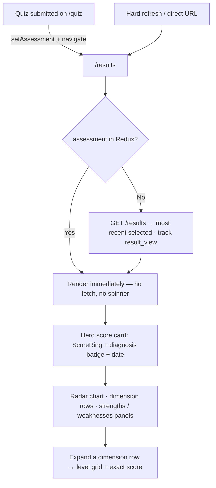
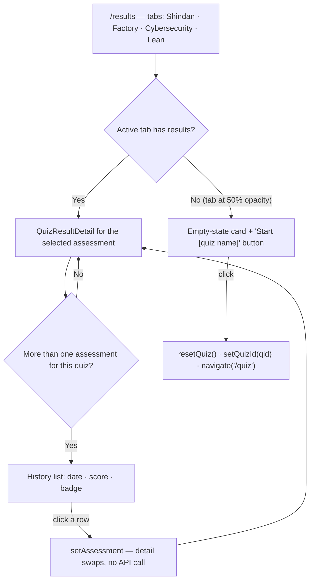

# Assessment Result — User Journeys

How each app's users move through the results page. See [README.md](./README.md) for the
design spec and [feature-spec.md](./feature-spec.md) for the formal requirements.

> Reflects what is **built today** — all journeys below are fully shipped; there are no
> roadmap steps in this feature.

---

## Table of Contents

- [Factory operator — viewing the result after a quiz](#factory-operator--viewing-the-result-after-a-quiz)
- [Factory operator — tabs, history and re-take](#factory-operator--tabs-history-and-re-take)

---

## Factory operator — viewing the result after a quiz

The operator lands on `/results` either fresh from a quiz submit (result already in Redux —
no spinner) or via hard refresh / direct URL (fetch from API).

**Guard(s):** `/results` requires an authenticated Firebase session; the backend scopes the
query to `middleware.GetUID(r)` — another user's assessment ID returns `404`. Detail in
[result-page.md](./result-page.md) and [result-service.md](./result-service.md).

---

## Factory operator — tabs, history and re-take

Tabs render for **all** available quiz variants; empty ones sit at 50% opacity with a
"Start" card. Multiple attempts at the same quiz produce a history list.

**Guard(s):** same authenticated session as above; the tab list comes from
`GET /quiz/quizzes` and history rows swap purely in Redux. Detail in
[result-page.md](./result-page.md).

---

*See [README.md](./README.md) for the feature spec.*

---

*Version: 1.0.0*
*Last updated: 3 July 2026*
