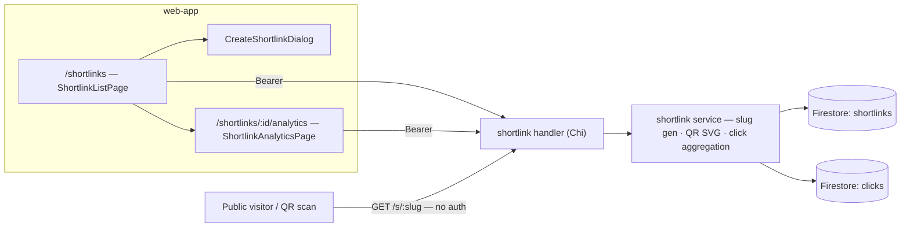

# Shortlink Service — Feature Spec

**Status:** 📋 Planning — nothing implemented yet; spec approved, no code started.

---

## Table of Contents

1. [App surfaces](#app-surfaces)
2. [Summary](#summary)
3. [Goals & Non-Goals](#goals--non-goals)
4. [Current State](#current-state)
5. [Design Overview](#design-overview)
6. [Build Sequence](#build-sequence)
7. [Security Invariants](#security-invariants)
8. [Acceptance Criteria](#acceptance-criteria)
9. [Testing](#testing)
10. [Open Items & Future Work](#open-items--future-work)
11. [References](#references)

---

> A URL shortening service (like bit.ly): authenticated users convert long URLs into short
> links on the `fs.link` domain, track click analytics (counts, geography, devices,
> referrers) and download a QR code per link. A new Go `shortlink` service serves the CRUD
> + analytics API and the public `/s/:slug` redirect; a new `web-app` section provides the
> management UI. Bilingual (TH/EN); shortlinks are user-scoped — users only ever see their
> own.

This README is the design index for the Shortlink Service feature. The formal requirements
live in the ISO 29110 SRS — see [feature-spec.md](./feature-spec.md). Each non-trivial
component is documented in a dedicated sub-document; see [References](#references).

---

## App surfaces

| web-app | backend |
|:-------:|:-------:|
| 📋 | 📋 |

`web-app` will host `/shortlinks` (list + create dialog) and `/shortlinks/:id/analytics`;
the backend will host the authenticated API plus the public redirect. No `web-official`
surface. Planned per-app flows live in [user-journeys.md](./user-journeys.md).

---

## Summary

| Component | Description |
|-----------|-------------|
| **Shortlink service** (backend) | `services/shortlink/` — CRUD, slug generation (nanoid), public `/s/:slug` redirect, click recording — see [shortlink-service.md](./shortlink-service.md) |
| **Click analytics** (backend) | `clicks` collection + aggregation endpoint (clicks over time, geography, devices, referrers, recent clicks) — see [click-analytics.md](./click-analytics.md) |
| **QR code generation** (backend) | 200×200 SVG QR per shortlink, stored on the document — see [qr-code-generation.md](./qr-code-generation.md) |
| **`ShortlinkListPage`** (web-app) | `/shortlinks` — list, create button, sort/search/pagination |
| **`CreateShortlinkDialog`** (web-app) | URL + optional custom slug (max 20 chars) with validation and availability check |
| **`ShortlinkAnalyticsPage`** (web-app) | `/shortlinks/:id/analytics` — recharts charts + referrer / recent-click tables |
| **`shortlinksSlice`** (web-app) | Redux state: shortlinks, current, analytics, loading, pagination |

---

## Goals & Non-Goals

From [feature-spec.md § 2](./feature-spec.md#2-goals--non-goals):

### Goals

- Provide authenticated users with URL shortening functionality.
- Track comprehensive analytics for each shortlink (clicks, geography, devices, referrers).
- Generate QR codes for shortlinks in SVG format.
- Expose RESTful API endpoints for shortlink CRUD operations.
- Create a user-friendly frontend interface for shortlink management.
- Implement proper authentication and authorization.
- Follow project conventions (Chi router, Firestore, Firebase Auth, `pkg` helpers).
- Support bilingual UI (TH/EN).
- Rate limit shortlink creation to prevent abuse.

### Non-Goals

- Public anonymous shortlink creation (all users must be authenticated).
- Custom domain support (initially `fs.link` only).
- Link expiration or TTL (links are permanent unless deleted).
- Bulk shortlink creation, link preview metadata (Open Graph), social sharing integrations.
- Export analytics data (CSV/Excel) — future enhancement.

---

## Current State

See [status.md](./status.md) for the per-component checklist — **every item is ❌ not
started**. [Build Sequence](#build-sequence) below has the task breakdown.

---

## Design Overview

### Data model

Full field tables in [feature-spec.md § 7](./feature-spec.md#7-firestore-schema):

| Collection | Document ID | Key fields | Notes |
|------------|-------------|------------|-------|
| `shortlinks` | `<shortlinkID>` (UUIDv4) | `uid` · `originalURL` · `shortURL` · `slug` (≤ 20 chars, unique) · `qrCodeSVG` · `totalClicks` · `uniqueClicks` · `createdAt` / `updatedAt` | Indexes: `uid` (listing) · `slug` (redirect lookup, unique) |
| `clicks` | `<clickID>` (UUIDv4) | `shortlinkID` · `slug` · `uid` (owner) · `userAgent` · `ip` · `country` / `countryName` / `city` · `device` · `referrer` · `clickedAt` | Composite indexes on `shortlinkID+clickedAt`, `slug+clickedAt`, `uid+clickedAt`; 90-day retention |

### API contract

Full request/response shapes in [feature-spec.md § 6](./feature-spec.md#6-backend-api):

| Method | Path | Auth / Role | Purpose |
|--------|------|-------------|---------|
| `POST` | `/api/v1/shortlinks` | Bearer | Create → `201` with slug, shortURL, qrCodeSVG · `400` · `429 RATE_LIMIT_EXCEEDED` |
| `GET` | `/api/v1/shortlinks` | Bearer | List own (limit/offset, sort by `createdAt` \| `totalClicks`) |
| `GET` | `/api/v1/shortlinks/:id` | Bearer | Details · `403` if owned by another user · `404` |
| `DELETE` | `/api/v1/shortlinks/:id` | Bearer | Delete → `204` · `403` / `404` |
| `GET` | `/api/v1/shortlinks/:id/analytics` | Bearer | Aggregated analytics over a date range (default last 30 days) |
| `GET` | `/s/:slug` | — public | Log click + `301` redirect to `originalURL` · `404` if missing/deleted |

---

## Build Sequence

From [feature-spec.md § 14](./feature-spec.md#14-open-tasks) — nothing started.

### Phase 1 — Backend

| # | Task | File(s) |
|---|------|---------|
| 1 | Service directory + models (request/response structs) | `apps/backend/services/shortlink/models.go` |
| 2 | Business logic — slug gen, CRUD, click recording | `apps/backend/services/shortlink/service.go` |
| 3 | QR code SVG generation | `apps/backend/services/shortlink/qrcode.go` |
| 4 | Chi routes + swagger annotations | `apps/backend/services/shortlink/handler.go` |
| 5 | Table-driven tests | `apps/backend/services/shortlink/service_test.go` |
| 6 | Firestore security rules for `shortlinks` + `clicks` | `firestore.rules` |
| 7 | Wire shortlink routes | `apps/backend/main.go` |

### Phase 2 — Frontend

| # | Task | File(s) |
|---|------|---------|
| 8 | Redux slice | `apps/web-app/src/store/shortlinksSlice.ts` |
| 9 | List page + routes + nav item | `apps/web-app/src/pages/ShortlinkListPage.tsx` |
| 10 | Create dialog | `apps/web-app/src/components/CreateShortlinkDialog.tsx` |
| 11 | List component (copy · QR download · delete confirm) | `apps/web-app/src/components/ShortlinkList.tsx` |
| 12 | Analytics page (recharts) | `apps/web-app/src/pages/ShortlinkAnalyticsPage.tsx` |

### Phase 3 — Analytics enhancement

| # | Task |
|---|------|
| 13 | Geolocation lookup (IP → country/city) |
| 14 | User-agent parsing (device detection) |
| 15 | Real-time aggregation + analytics caching |

---

## Security Invariants

From [feature-spec.md § 13](./feature-spec.md#13-security--privacy) — to be enforced when built:

| Invariant | Where enforced |
|-----------|----------------|
| UID taken from `middleware.GetUID(r)`, never the request body/path | `services/shortlink/handler.go` |
| Users can only access their own shortlinks — cross-user access → `403` / `404` | `services/shortlink/service.go` |
| Creation rate-limited (10/hour per user); redirect rate-limited (100/min per IP) | middleware + service |
| IP addresses logged for analytics only — never exposed in API responses | `services/shortlink/` (analytics aggregation) |
| Click data retention 90 days (configurable) | Firestore TTL / cleanup |
| URL + slug input validated (HTTP/HTTPS URL; slug alphanumeric + hyphen, ≤ 20 chars, unique) | client Zod + `services/shortlink/service.go` |

---

## Acceptance Criteria

Verbatim from [feature-spec.md § 15](./feature-spec.md#15-acceptance-criteria); nothing is
built, so all unchecked.

**Backend** — see [shortlink-service.md](./shortlink-service.md)
- [ ] `POST /api/v1/shortlinks` creates a shortlink and returns 201 with slug, shortURL, and qrCodeSVG
- [ ] Custom slug validation rejects invalid formats and existing slugs
- [ ] Auto-generated slugs use nanoid (7 chars, URL-safe, unique)
- [ ] `GET /api/v1/shortlinks` returns only the authenticated user's shortlinks
- [ ] `GET /api/v1/shortlinks/:id` returns 403 for shortlinks owned by other users
- [ ] `DELETE /api/v1/shortlinks/:id` deletes shortlink and returns 204
- [ ] `GET /s/:slug` redirects to original URL with 301 status
- [ ] `GET /s/:slug` logs click event to `clicks` collection
- [ ] `GET /api/v1/shortlinks/:id/analytics` returns aggregated analytics data
- [ ] Analytics include: totalClicks, uniqueClicks, clicksOverTime, geographicDistribution, deviceBreakdown, topReferrers, recentClicks
- [ ] Rate limiting enforced on shortlink creation (10/hour per user)
- [ ] `make test-api` passes for all shortlink service tests
- [ ] Swagger annotations present on all endpoints

**Frontend**
- [ ] `/shortlinks` page renders list of user's shortlinks
- [ ] "Create Shortlink" button opens dialog with URL input
- [ ] URL validation prevents invalid URLs
- [ ] Custom slug input shows character count (max 20)
- [ ] Creating shortlink updates list without page reload
- [ ] Copy link button copies short URL to clipboard
- [ ] Download QR button downloads SVG file
- [ ] Delete button shows confirmation dialog before deletion
- [ ] View Analytics button navigates to analytics page
- [ ] Analytics page shows charts for clicks over time, geography, devices
- [ ] Analytics page shows top referrers and recent clicks tables
- [ ] All UI text uses i18n (TH/EN)
- [ ] Date/time formatting uses `formatDateTime()` from `@/lib/dayjs`
- [ ] `make lint-web` and `make test-web` pass

**Integration**
- [ ] Clicking a shortlink (`/s/:slug`) increments click count in Firestore
- [ ] Click analytics appear in frontend within 5 seconds (eventual consistency acceptable)
- [ ] QR code scans redirect correctly to original URL
- [ ] Shortlink creation rate limit displays user-friendly error message
- [ ] Deleted shortlinks return 404 on redirect attempts

---

## Testing

Planned suites per [feature-spec.md § 16](./feature-spec.md#16-testing):

| Package | Target | Phase | Notes |
|---------|--------|-------|-------|
| `services/shortlink/service_test.go` | Create (valid/custom/duplicate slug, invalid URL, QR), Get/List (scoping, `ErrShortlinkNotFound`), `RecordClick` (counters, unique dedupe), `GetAnalytics` (grouping, ordering) | 1 | Table-driven; assert sentinel errors |
| Integration | Create → redirect → click logged; custom slug redirect; delete → redirect 404; list-all; rate limit after 10/hr | 1 | |
| E2E (Playwright) | List render, create/copy/delete flows, analytics charts, redirect + counter increment | 2 | |

Coverage target: critical `services/` ≥ 80% (`go test ./... -cover`).

---

## Open Items & Future Work

### Future enhancements

From [feature-spec.md § 14.4](./feature-spec.md#144-future-enhancements) — all unscheduled:

| # | Area | Description |
|---|------|-------------|
| 1 | Custom domains | Per-user custom domain support |
| 2 | Expiration | Shortlink expiration / TTL |
| 3 | Bulk create | Bulk shortlink creation |
| 4 | Export | Analytics export (CSV/Excel) |
| 5 | Experiments | A/B testing for shortlinks; UTM parameter tracking and reporting |

---

## References

### Sub-documents

| Doc | Covers |
|-----|--------|
| [feature-spec.md](./feature-spec.md) | ISO 29110 SRS — formal requirements, schemas, i18n key map |
| [status.md](./status.md) | Current implementation status per component (all not started) |
| [user-journeys.md](./user-journeys.md) | Planned user flows (creator · analytics viewer · public visitor) |
| [shortlink-service.md](./shortlink-service.md) | Backend service — interface, sentinel errors, redirect flow |
| [click-analytics.md](./click-analytics.md) | Click recording + analytics aggregation |
| [qr-code-generation.md](./qr-code-generation.md) | QR code SVG generation + storage |
| [mockups/app.md](./mockups/app.md) | ASCII wireframes — planned `/shortlinks` screens (web-app) |

### ISO 29110 artifacts

- Test plan: copy `docs/iso29110/test-plan-template.md` → `test-plan.md` before implementation starts
- Log scope changes in [docs/iso29110/change-request-log.md](../../iso29110/change-request-log.md)
- New risks → [docs/iso29110/risk-register.md](../../iso29110/risk-register.md)

### Cross-references

From [feature-spec.md § 19](./feature-spec.md#19-references):

- [API conventions](../../api/conventions.md) · [Swagger setup](../../api/swagger.md)
- [Error handling](../../development/error-handling.md) · [Go patterns](../../development/go-patterns.md) · [Testing guide](../../development/testing-guide.md)
- [i18n / locale guide](../../development/locale-guide.md)
- [Firestore schema](../../architecture/database.md)

---

*Version: 1.0.0*
*Last updated: 3 July 2026*
