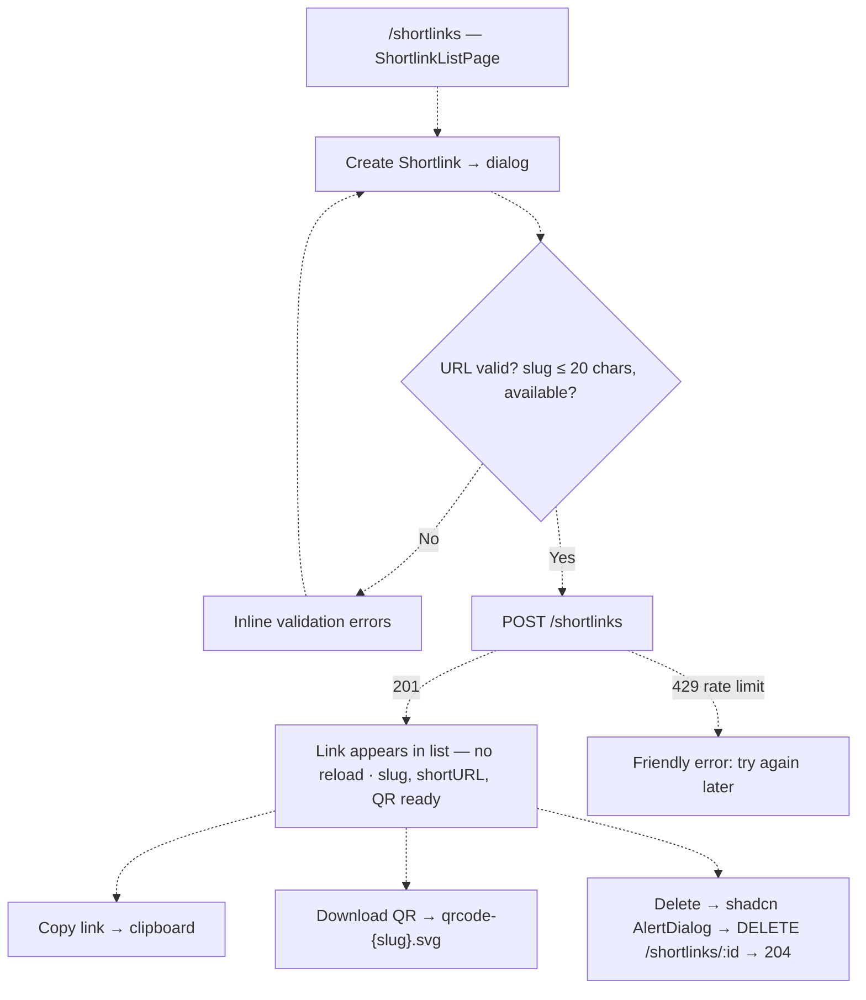
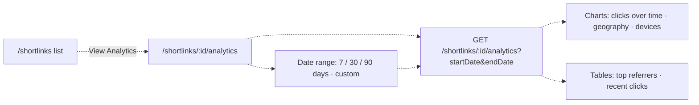
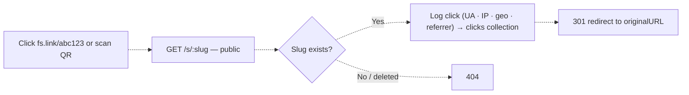

# Shortlink Service — User Journeys

How each app's users will move through the shortlink feature. See
[README.md](./README.md) for the design spec and [feature-spec.md](./feature-spec.md) for
the formal requirements.

> Reflects what is **built today** — nothing. The feature is in planning; **every journey
> below is roadmap**, so all edges are shown dashed.

---

## Table of Contents

- [Authenticated user — creating and managing shortlinks](#authenticated-user--creating-and-managing-shortlinks)
- [Authenticated user — viewing analytics](#authenticated-user--viewing-analytics)
- [Public visitor — following a shortlink](#public-visitor--following-a-shortlink)

---

## Authenticated user — creating and managing shortlinks

An authenticated `web-app` user shortens a long URL (optionally with a custom slug) and
manages their links from `/shortlinks`.

**Guard(s):** all management routes require a Bearer Firebase token; UID from
`middleware.GetUID(r)`; creation rate-limited to 10/hour per user. Detail in
[shortlink-service.md](./shortlink-service.md).

---

## Authenticated user — viewing analytics

The link owner inspects click performance over a chosen date range.

**Guard(s):** Bearer token; `403` when the shortlink belongs to another user. IPs are never
exposed in responses. Detail in [click-analytics.md](./click-analytics.md).

---

## Public visitor — following a shortlink

Anyone (no auth) clicking a short URL or scanning its QR code is redirected while the click
is logged.

**Guard(s):** none for the redirect itself (public by design); rate-limited 100/min per IP
to prevent abuse. Detail in [shortlink-service.md](./shortlink-service.md).

---

*See [README.md](./README.md) for the feature spec.*

---

*Version: 1.0.0*
*Last updated: 3 July 2026*
