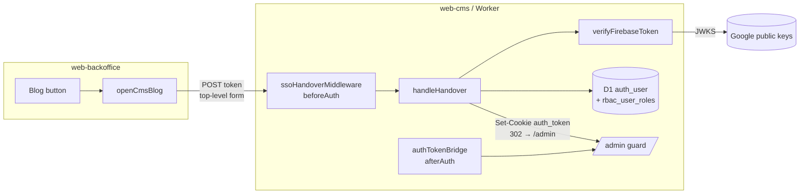
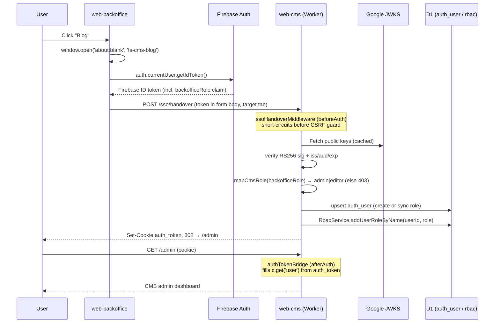

# Backoffice → CMS SSO Handover — Feature Spec

**Status:** ✅ Implemented — a signed-in web-backoffice user opens the web-cms `/admin` in a new tab with no second login.

---

## Table of Contents

1. [App surfaces](#app-surfaces)
2. [Summary](#summary)
3. [Goals & Non-Goals](#goals--non-goals)
4. [Design Overview](#design-overview)
5. [Sequence](#sequence)
6. [Role mapping](#role-mapping)
7. [Data model](#data-model)
8. [Configuration](#configuration)
9. [Operations](#operations)
10. [Security Invariants](#security-invariants)
11. [Acceptance Criteria](#acceptance-criteria)
12. [Testing](#testing)
13. [Open Items & Future Work](#open-items--future-work)
14. [References](#references)

---

web-cms (the SonicJS blog/CMS on Cloudflare Workers) runs its **own** auth, separate from the
Firebase-backed web-backoffice. Rather than ask backoffice staff to maintain a second password,
SSO handover lets a user who is already signed into web-backoffice click **Blog** and land on the
CMS `/admin` already authenticated. The handover passes the user's **Firebase ID token** to the
CMS, which verifies it inside the Worker, provisions/maps the user, and starts a CMS admin session.

This README is the design index for the SSO Handover feature. It documents the live implementation
across three packages: `apps/web-backoffice` (initiator), `packages/shared` (URL helpers), and
`apps/web-cms` (verifier + session).

---

## App surfaces

| web-backoffice | web-cms | web-app | web-official | backend |
|:--------------:|:-------:|:-------:|:------------:|:-------:|
| ✅ initiator | ✅ verifier + session | — | — | ⬩ mints `backofficeRole` claim |

The backend is indirect: it sets the `backofficeRole` Firebase custom claim
([middleware/auth.go](../../../apps/backend/middleware/auth.go), [cmd/set-superadmin](../../../apps/backend/cmd/set-superadmin/main.go)).
web-cms trusts that claim because it is inside the signed token.

---

## Summary

| Component | File | Role |
|-----------|------|------|
| **Sidebar Blog button** | [web-backoffice/src/components/Sidebar.tsx](../../../apps/web-backoffice/src/components/Sidebar.tsx) | Opens a tab, triggers handover on click |
| **`openCmsBlog`** | [web-backoffice/src/lib/cmsSso.ts](../../../apps/web-backoffice/src/lib/cmsSso.ts) | Top-level form POST of the Firebase ID token |
| **`getCmsSsoUrl` / `getCmsAdminUrl`** | [packages/shared/lib/cmsSite.ts](../../../packages/shared/lib/cmsSite.ts) | Resolve the CMS base URL per environment |
| **`ssoHandoverMiddleware`** | [web-cms/src/sso/middleware.ts](../../../apps/web-cms/src/sso/middleware.ts) | `beforeAuth` route mount, CSRF-exempt by design |
| **`handleHandover`** | [web-cms/src/sso/handover.ts](../../../apps/web-cms/src/sso/handover.ts) | Verify → map role → upsert user → assign RBAC → mint session |
| **`verifyFirebaseToken`** | [web-cms/src/sso/firebase-verify.ts](../../../apps/web-cms/src/sso/firebase-verify.ts) | RS256 JWKS verification of the Firebase ID token |
| **`authTokenBridge`** | [web-cms/src/sso/auth-token-bridge.ts](../../../apps/web-cms/src/sso/auth-token-bridge.ts) | `afterAuth` bridge so the legacy `auth_token` honors the `/admin` guard |

---

## Goals & Non-Goals

### Goals

- A signed-in backoffice user reaches the CMS `/admin` without a second sign-in.
- Only backoffice staff (`superadmin` / `staff`) can obtain a CMS session.
- No CMS password to manage; the Firebase identity is the single source of truth.
- The token never appears in a URL, history, or referer.

### Non-Goals

- **No CMS → backoffice handover.** The flow is one-directional.
- **No shared session / SSO cookie domain.** The CMS mints its own independent `auth_token`.
- **No live sync of role revocation.** Removing `backofficeRole` blocks *new* handovers but does
  not kill an already-issued CMS session (it expires on its own). See [Open Items](#open-items--future-work).
- **No self-service signup** into the CMS — accounts are provisioned only via handover.

---

## Design Overview



Two interception points are needed because SonicJS beta.20 authenticates `/admin` from a
**better-auth session**, while the handover mints the **legacy `auth_token` JWT**:

- **`beforeAuth` (`ssoHandoverMiddleware`)** — handles `POST /sso/handover` *ahead* of core's
  hardcoded `csrfProtection()`. The route is CSRF-exempt by design: the unforgeable Firebase ID
  token *is* the anti-CSRF token. Without this, the second handover onward (once `auth_token` is
  set) would be rejected `403 CSRF token missing`.
- **`afterAuth` (`authTokenBridge`)** — runs after better-auth's `getSession()`; when no session
  was established, it verifies the `auth_token` cookie and projects its claims onto `c.get('user')`
  so the `/admin` guard accepts the handed-off user.

---

## Sequence



**Why the tab is opened *before* the `await`:** `openCmsBlog` opens the target tab synchronously
inside the click gesture, then awaits the token. If it opened the tab after the async call, the
browser would treat the submit as a blocked popup.

---

## Role mapping

`mapCmsRole` ([handover.ts](../../../apps/web-cms/src/sso/handover.ts)) translates the backoffice
role (Firebase `backofficeRole` custom claim) to a CMS role. Anyone else gets `403`.

| backoffice `backofficeRole` | CMS role | CMS capability |
|-----------------------------|----------|----------------|
| `superadmin` | `admin` | Full admin |
| `staff` | `editor` | Content editor |
| _(anything else / absent)_ | — | **403** — "Your account does not have access to the CMS." |

Both `admin` and `editor` carry the `portal:access` RBAC grant — the actual `/admin` gate is
`rbac_user_roles`, **not** the `auth_user.role` column, which is why the handover assigns the RBAC
role explicitly after upserting the user.

---

## Data model

D1 (Cloudflare SQLite), tables owned by SonicJS core:

| Table | Written by handover | Notes |
|-------|--------------------|-------|
| `auth_user` | upsert by `email` — create with `is_active=1, email_verified=1`, else sync `role`/`name` and reactivate | `last_name` is `NOT NULL`; `splitName` falls back to `-` |
| `rbac_user_roles` | `RbacService.addUserRoleByName(userId, role)` (idempotent) | The true `/admin` gate |

> ⚠️ **Schema patch required.** Core beta.20's migrations omit three `auth_user` columns its
> runtime model expects, so *every* user INSERT fails until patched. Apply
> [patches/0001_auth_user_authfields.sql](../../../apps/web-cms/patches/0001_auth_user_authfields.sql)
> once per database (see [Operations](#operations)).

---

## Configuration

| Setting | Where | Purpose |
|---------|-------|---------|
| `FIREBASE_PROJECT_ID` | [web-cms/wrangler.toml](../../../apps/web-cms/wrangler.toml) `[vars]` | The Firebase project whose ID tokens `/sso/handover` trusts. Local dev points at the **staging** project. |
| `JWT_SECRET` | Worker **secret** (`wrangler secret put`) — never in `wrangler.toml`/`.dev.vars` committed | Signs/verifies the legacy `auth_token`. |
| `VITE_CMS_URL` | [web-backoffice/.env.example](../../../apps/web-backoffice/.env.example) | CMS base URL the Blog link targets (e.g. `https://factorysyncsolutions.com`). |
| `CORS_ORIGINS` | `wrangler.toml` `[vars]` | Allowed origins for the CMS Worker. |

URL resolution ([cmsSite.ts](../../../packages/shared/lib/cmsSite.ts)): in development the helpers
target `http://localhost:8787`; otherwise `VITE_CMS_URL` (fallback `https://factorysyncsolutions.com`).
The handover endpoint is `<base>/sso/handover`; the dashboard is `<base>/admin`.

---

## Operations

**Apply the auth_user schema patch** (one-time per database; re-apply after `db:reset`):

```bash
# local
pnpm --filter @repo/web-cms exec wrangler d1 execute DB --local \
  --file=patches/0001_auth_user_authfields.sql
# staging
pnpm --filter @repo/web-cms exec wrangler d1 execute DB --env staging --remote \
  --file=patches/0001_auth_user_authfields.sql
# production
pnpm --filter @repo/web-cms exec wrangler d1 execute DB --env production --remote \
  --file=patches/0001_auth_user_authfields.sql
```

**Set the CMS JWT secret** (per environment):

```bash
pnpm --filter @repo/web-cms exec wrangler secret put JWT_SECRET --env staging
```

**Grant a user backoffice access** (so handover maps to a CMS role) — set the `backofficeRole`
claim via the backoffice staff API (`PUT /api/v1/backoffice/staff/{uid}`, superadmin only) or the
`cmd/set-superadmin` helper for the first superadmin.

---

## Security Invariants

| Invariant | Where enforced |
|-----------|----------------|
| Firebase ID token verified (RS256 + `iss`/`aud`/`exp`) against Google JWKS | [firebase-verify.ts](../../../apps/web-cms/src/sso/firebase-verify.ts) |
| Role comes from the **signed** `backofficeRole` claim, not the request body | `verifyFirebaseToken` → `mapCmsRole` |
| Non-backoffice users rejected `403` before any session is minted | [handover.ts](../../../apps/web-cms/src/sso/handover.ts) `mapCmsRole` |
| Token travels in a POST **body**, never a URL/query/referer | [cmsSso.ts](../../../apps/web-backoffice/src/lib/cmsSso.ts) |
| CSRF exemption justified — the unforgeable ID token *is* the anti-CSRF token | [middleware.ts](../../../apps/web-cms/src/sso/middleware.ts) |
| `auth_token` is a JWT signed with `JWT_SECRET`; bridge cannot be forged client-side | [auth-token-bridge.ts](../../../apps/web-cms/src/sso/auth-token-bridge.ts) |
| SSO users are never platform super-admins (`is_super_admin=0`, bridge sets `isSuperAdmin:false`) | `upsertUser` + `authTokenBridge` |
| `JWT_SECRET` is a Worker secret, never committed | `wrangler secret` |

---

## Acceptance Criteria

- [ ] Given a signed-in `superadmin`, when they click **Blog**, then a new tab lands on `/admin` as CMS `admin`.
- [ ] Given a signed-in `staff` user, when they click **Blog**, then they land on `/admin` as CMS `editor`.
- [ ] Given a signed-in user with **no** `backofficeRole`, when they handover, then `403` "does not have access to the CMS".
- [ ] Given an expired/invalid Firebase token, when posted to `/sso/handover`, then redirect to `/auth/login`.
- [ ] Given a missing `token` field, when posted, then redirect to `/auth/login`.
- [ ] Given a repeat handover (cookie already set), when posted, then it succeeds (CSRF-exempt — no `403`).
- [ ] Given a first-time user, when handover succeeds, then an `auth_user` row and an `rbac_user_roles` entry exist.
- [ ] Given `FIREBASE_PROJECT_ID` unset, when posted, then `500` "SSO is not configured".

---

## Testing

| File | Covers |
|------|--------|
| [web-cms/src/sso/handover.test.ts](../../../apps/web-cms/src/sso/handover.test.ts) | `mapCmsRole` role mapping, `splitName` name fallback |

Run: `pnpm --filter @repo/web-cms test`. Future: integration test for the full `handleHandover`
path (token verify → upsert → RBAC → cookie) with a mocked JWKS + D1.

---

## Open Items & Future Work

| # | Item | Notes |
|---|------|-------|
| 1 | Role revocation does not kill live CMS sessions | Removing `backofficeRole` blocks new handovers; an issued `auth_token` lives until expiry. Consider a shorter TTL or a revocation check. |
| 2 | Patch `0001_auth_user_authfields.sql` is out-of-band | Remove once core ships the columns; `migrations_dir` points at `node_modules` so the fix can't live there. |
| 3 | No full-path integration test | `handover.test.ts` only covers pure helpers today. |
| 4 | One-directional only | No CMS → backoffice return handoff is planned. |

---

## References

### Sub-documents

| Doc | Covers |
|-----|--------|
| [feature-spec.md](./feature-spec.md) | ISO 29110 SRS — formal requirements (FR-001…FR-007, traceability) |
| [status.md](./status.md) | Implementation status per component |
| [user-journeys.md](./user-journeys.md) | Per-actor flows (superadmin / staff / denied) |

### Source

| File | Covers |
|------|--------|
| [cmsSso.ts](../../../apps/web-backoffice/src/lib/cmsSso.ts) | Backoffice initiator (form POST) |
| [cmsSite.ts](../../../packages/shared/lib/cmsSite.ts) | CMS URL resolution per environment |
| [middleware.ts](../../../apps/web-cms/src/sso/middleware.ts) | `beforeAuth` route mount, CSRF exemption |
| [handover.ts](../../../apps/web-cms/src/sso/handover.ts) | Verify → map → upsert → RBAC → session |
| [firebase-verify.ts](../../../apps/web-cms/src/sso/firebase-verify.ts) | Firebase ID token verification |
| [auth-token-bridge.ts](../../../apps/web-cms/src/sso/auth-token-bridge.ts) | `afterAuth` legacy-token bridge |
| [0001_auth_user_authfields.sql](../../../apps/web-cms/patches/0001_auth_user_authfields.sql) | D1 schema patch |

### Cross-references

- [Backoffice feature](../backoffice/feature-spec.md) · [Auth feature](../auth/feature-spec.md)
- Backend `backofficeRole` claim: [middleware/auth.go](../../../apps/backend/middleware/auth.go)

### External

- Firebase ID token verification: https://firebase.google.com/docs/auth/admin/verify-id-tokens
- SonicJS: https://sonicjs.com · `jose` (JWKS): https://github.com/panva/jose

---

*Version: 1.0.0*
*Last updated: 30 June 2026*
