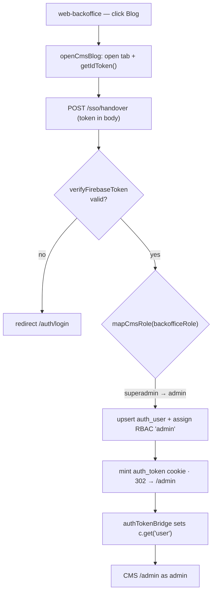
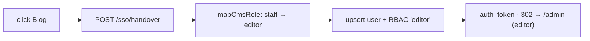
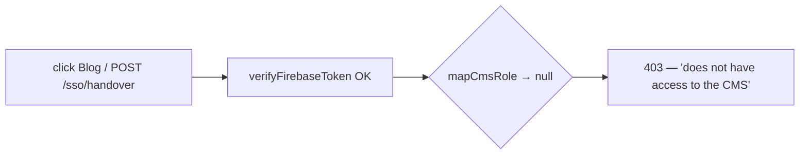

# Backoffice → CMS SSO Handover — User Journeys

How backoffice users move from web-backoffice into the web-cms admin. See
[README.md](./README.md) for the design spec and [feature-spec.md](./feature-spec.md) for the
formal requirements.

> Reflects what is **built today** — the full handover is implemented. There is no CMS →
> backoffice return path (out of scope); no journey steps are roadmap-only.

---

## Table of Contents

- [Super admin — open the CMS as admin](#super-admin--open-the-cms-as-admin)
- [Backoffice staff — open the CMS as editor](#backoffice-staff--open-the-cms-as-editor)
- [Denied user — no backoffice role](#denied-user--no-backoffice-role)

---

## Super admin — open the CMS as admin

A FactorySync superadmin, already signed into web-backoffice, wants to manage blog content
without a second login.

**Guard(s):** the backoffice tab requires a valid Firebase session; CMS `/admin` is gated on the
`portal:access` RBAC grant via `rbac_user_roles` (assigned during handover). Role comes from the
signed `backofficeRole` claim — verified in [firebase-verify.ts](../../../apps/web-cms/src/sso/firebase-verify.ts).

---

## Backoffice staff — open the CMS as editor

Identical entry, mapped to the lower-privilege CMS role.

**Guard(s):** `staff` maps to CMS `editor`; both `admin` and `editor` carry `portal:access`, so
the editor reaches `/admin` with content-editor capability. Mapping in
[handover.ts](../../../apps/web-cms/src/sso/handover.ts).

---

## Denied user — no backoffice role

A user signed into Firebase but without a `backofficeRole` claim.

**Guard(s):** `mapCmsRole` returns null for any non-backoffice role, and `handleHandover` responds
`403` **before** minting any session — no `auth_user` row or cookie is created.

---

*See [README.md](./README.md) for the feature spec.*

---

*Version: 1.0.0*
*Last updated: 30 June 2026*
