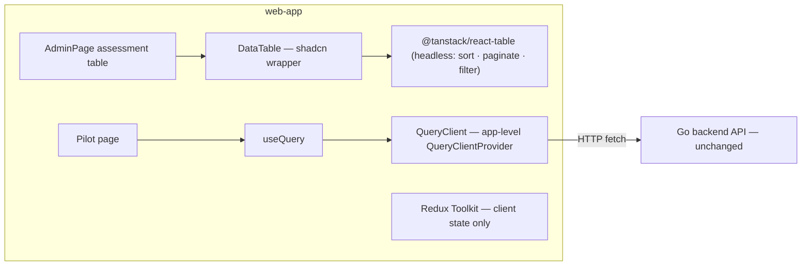

# TanStack Table + Query Adoption — Feature Spec

**Status:** 📋 Approved SRS (CR-003) — DataTable + Query pilot scoped for `web-app`; build progress in [status.md](./status.md).

---

## Table of Contents

1. [App surfaces](#app-surfaces)
2. [Summary](#summary)
3. [Goals & Non-Goals](#goals--non-goals)
4. [Current State](#current-state)
5. [Design Overview](#design-overview)
6. [Acceptance Criteria](#acceptance-criteria)
7. [Testing](#testing)
8. [Open Items & Future Work](#open-items--future-work)
9. [References](#references)

---

> Internal frontend refactor — no new product feature. Replaces hand-rolled UI plumbing in
> `apps/web-app` with two headless TanStack libraries the app's form layer already uses:
> `@tanstack/react-table` behind a reusable shadcn `DataTable` (first consumer: the AdminPage
> assessment table), and `@tanstack/react-query` for server state, piloted on one read-heavy
> page before a wider per-page rollout. Redux Toolkit is retained for client state; the
> Query/Redux boundary becomes a documented convention in `.claude/rules/react.md`.

This README is the design index for the TanStack adoption work. The formal requirements
live in the ISO 29110 SRS — see [feature-spec.md](./feature-spec.md); the change is logged
as [CR-003](../../iso29110/change-request-log.md).

---

## App surfaces

| web-app |
|:-------:|
| 📋 |

Frontend-only refactor inside `apps/web-app` — no backend or web-official changes, and no
new routes or screens; existing pages keep their current UX. No user-journeys/mockups docs
for this folder.

---

## Summary

| Component | Description |
|-----------|-------------|
| **`DataTable` + `table` primitive** | Reusable shadcn table component built on `@tanstack/react-table` (headless) |
| **AdminPage assessment table migration** | Client-side sorting, pagination (10 rows/page), and company-name search — preserving expandable detail rows, responsive hidden columns, server-side industry/size filters, `data-testid` hooks, and `useLocale()` i18n |
| **TanStack Query pilot** | `QueryClientProvider` wraps the app; one read-heavy page migrates from manual `fetch`+`useState`+`useEffect` to `useQuery` with identical `Skeleton` loading and error UX |
| **Convention update** | Query/Redux state-ownership boundary documented in `.claude/rules/react.md` |

---

## Goals & Non-Goals

### Goals

- Build a reusable shadcn `DataTable` + `table` primitive on `@tanstack/react-table`.
- Migrate the AdminPage assessment table to `DataTable` with client-side sort, pagination, and search — behaviour-preserving (FR-004).
- Set up `QueryClientProvider` and migrate **one** read-heavy page to `@tanstack/react-query` as a pilot.
- Document the server-state (Query) vs client-state (Redux) boundary in `.claude/rules/react.md`.

### Non-Goals

- Migrating all fetch call sites to Query — the per-page rollout is a follow-up after the pilot.
- Migrating the AdminPage feature-matrix table and user-management tables (assessment table only).
- Removing Redux — Redux Toolkit stays for client state (auth session, in-progress quiz answers).

---

## Current State

See [status.md](./status.md) for the implementation checklist. The SRS itself records no
implementation status — items are ticked there as they merge into `develop`.

---

## Design Overview

### State ownership (per feature-spec § 1.3)

| State kind | Examples | Owner |
|------------|----------|-------|
| Server state | Assessments, results — backend-owned data fetched over HTTP | TanStack Query |
| Client state | Auth session, in-progress quiz answers | Redux Toolkit |

No backend, data-model, or API-contract changes — the refactor swaps how existing responses
are fetched and rendered, not what is served.

---

## Acceptance Criteria

Mirrors [feature-spec.md § 4](./feature-spec.md#4-acceptance-criteria); nothing is marked
built in the spec, so all items are open.

- [ ] AdminPage table sorts (Company, Score, Date), paginates (default 10 rows/page), and searches by company name; expandable rows and server-side industry/size filters still work; tests green.
- [ ] Pilot page fetches via `useQuery` with unchanged loading (`Skeleton`) and error UX.
- [ ] `.claude/rules/react.md` updated to reflect TanStack Query as the server-state convention.

---

## Testing

No new backend surface — verification is the existing frontend toolchain (NFR-003):

| Check | Target | Notes |
|-------|--------|-------|
| `pnpm build` · Biome · `tsc` · Vitest | `@repo/web-app` | Must pass with the migration in place |
| Playwright e2e | `@repo/web-app` | Existing suites must remain green — FR-004 preserves all `data-testid` hooks |

---

## Open Items & Future Work

| # | Area | Description |
|---|------|-------------|
| 1 | Query rollout | Per-page migration of the remaining fetch call sites after the pilot proves out |
| 2 | Remaining tables | Migrate the AdminPage feature-matrix and user-management tables to `DataTable` |

### Open decisions

None recorded in the SRS.

---

## References

### Sub-documents

| Doc | Covers |
|-----|--------|
| [feature-spec.md](./feature-spec.md) | ISO 29110 SRS — formal requirements (FR-001…006, NFR-001…004) |
| [status.md](./status.md) | Current implementation status per component |

No user-journeys, component sub-docs, or mockups — internal refactor with no new UI surface.

### ISO 29110 artifacts

- Change request: [CR-003](../../iso29110/change-request-log.md)
- New risks → [docs/iso29110/risk-register.md](../../iso29110/risk-register.md)

### Cross-references

- [.claude/rules/react.md](../../../.claude/rules/react.md) — receives the Query/Redux boundary convention (NFR-004)
- [AdminPage.tsx](../../../apps/web-app/src/pages/AdminPage.tsx) — hosts the assessment table being migrated

### External standards

- TanStack Table: https://tanstack.com/table · TanStack Query: https://tanstack.com/query

---

*Version: 1.0.0*
*Last updated: 3 July 2026*
