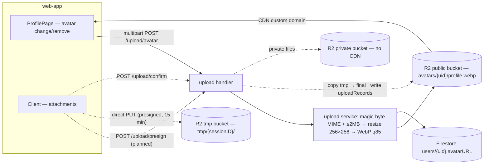

# Upload Service — Feature Spec

**Status:** ⚠️ Phase 1 shipped — avatar upload/delete live on Cloudflare R2; Phases 2–3 (presign flow, private files) planned.

---

## Table of Contents

1. [App surfaces](#app-surfaces)
2. [Summary](#summary)
3. [Goals & Non-Goals](#goals--non-goals)
4. [Current State](#current-state)
5. [Design Overview](#design-overview)
6. [Security Invariants](#security-invariants)
7. [Acceptance Criteria](#acceptance-criteria)
8. [Testing](#testing)
9. [Open Items & Future Work](#open-items--future-work)
10. [References](#references)

---

> General-purpose file and image upload service backed by **Cloudflare R2** (S3-compatible
> object storage) with CDN delivery. Phase 1 — profile avatar upload for authenticated
> `web-app` users — is implemented end to end in `apps/backend/services/upload/`, replacing
> the old Firebase Storage path. Later phases add a unified presign → PUT → confirm pipeline
> for general public files (permanent CDN URLs) and project-scoped private files (time-limited
> read URLs issued after authorization).

This README is the design index for the Upload Service. The formal spec — bucket layout,
full endpoint contracts, allowlists, and Firestore model — lives in
[feature-spec.md](./feature-spec.md). Each non-trivial component is documented in a
dedicated sub-document; see [References](#references).

---

## App surfaces

| web-app | backend |
|:-------:|:-------:|
| ✅ | ✅ |

`web-app` calls the avatar endpoints from `ProfilePage.tsx`; the backend owns the R2 client,
image pipeline, and (planned) presign/confirm/read-url flows. `web-official` is untouched.
Phase 2–3 frontend flows are planned only. Per-app flows live in
[user-journeys.md](./user-journeys.md).

---

## Summary

| Component | Description | Phase |
|-----------|-------------|-------|
| **Avatar upload** | `POST`/`DELETE /api/v1/upload/avatar` — validate → resize 256×256 → WebP → R2 `avatars/{uid}/profile.webp` → `avatarURL` in Firestore — see [avatar-upload.md](./avatar-upload.md) | Phase 1 — ✅ shipped |
| **R2 client** (`r2.go`) | S3-compatible client (aws-sdk-go-v2) against `https://{accountID}.r2.cloudflarestorage.com` | Phase 1 — ✅ shipped |
| **Presign flow** | `POST /upload/presign` → direct client PUT to a tmp bucket → `POST /upload/confirm`; public files get permanent CDN URLs; `DELETE /upload/file` by `recordID` — see [presign-flow.md](./presign-flow.md) | Phase 2 — 📋 planned |
| **Private files** | Project-scoped storage; `POST /upload/read-url` issues 1-hour presigned GET URLs after project/resource authorization — see [presign-flow.md](./presign-flow.md) | Phase 3 — 📋 planned |
| **Backoffice upload utility** | `POST /api/v1/backoffice/upload/file` — direct-through-backend upload (no presign, no Firestore record), staff/superadmin only, powers a `web-backoffice` "Utilities" page — see [bo-upload-utility](../bo-upload-utility/README.md) | Standalone utility — ✅ shipped, **not** a Phase 2/3 step |

---

## Goals & Non-Goals

### Goals

- Single upload service handling all file types (images, PDFs, spreadsheets).
- Full CRUD for images — create (upload), read (CDN or signed URL), update (upload replacement + swap reference), delete (by `recordID`).
- Image processing pipeline for avatars: resize, WebP conversion.
- Presigned URLs for direct client → R2 uploads (bypasses the backend for large files).
- CDN delivery via Cloudflare (R2 custom domain + cache); zero egress fees.
- Per-user / per-resource scoped, server-generated, immutable object keys.
- Server-side size + MIME validation — magic bytes for avatars; declared metadata at presign, re-verified against R2 `HeadObject` on confirm.
- Public visibility (CDN URL, no auth) and private visibility (project-scoped, time-limited read URLs).

### Non-Goals (v1)

- Video transcoding.
- Multi-part uploads (files > 100 MB).
- Real-time upload progress via WebSocket (polling is fine).

---

## Current State

See [status.md](./status.md) for the per-phase implementation checklist. As of 14 June 2026:
Phase 1 (avatar upload) is shipped; Phases 2–3 (presign, confirm, read-url, general file
delete) remain planned.

As of 4 July 2026, `services/upload/handler.go` also has a `BackofficeRoutes` /
`UploadFile` pair — this is the [backoffice upload utility](../bo-upload-utility/README.md)
(CR-008), a standalone direct-through-backend endpoint for staff. Do not read
its presence as Phase 2 progress: it has no presign step, no tmp bucket, and
writes no Firestore record, unlike the `Presign`/`Confirm` design below.

---

## Design Overview

Public, private, and tmp objects live in **separate buckets** — the public bucket has a CDN
custom domain; the private and tmp buckets are never publicly exposed. Full bucket layout
and environment variables in [feature-spec.md § Storage](./feature-spec.md#storage-cloudflare-r2).

### Data model

Two Firestore collections, owned exclusively by the upload service (both Phase 2 — planned):

| Collection | Document ID | Key fields | Notes |
|------------|-------------|------------|-------|
| `uploadSessions` | `<sessionID>` | `recordID` · `fileID` · `ownerUID` · `visibility` · `tmpKey` · `finalKey` · `isConfirmed: bool` · `createdAt` | Written on presign; confirmed/cleaned by confirm; stale-session cleanup job needed |
| `uploadRecords` | `<recordID>` | `ownerUID` · `visibility` · `projectID` · `resourceType`/`resourceID` · `fileKey` · `fileURL` (public only) · `confirmedAt` | Written on confirm; authorization source for read-url and delete |

Phase 1 stores only `users/{uid}.avatarURL` (existing profile document — no new collection).

### API contract

All endpoints require `Authorization: Bearer <firebase-id-token>`. Full request/response
shapes and error tables in [feature-spec.md § API Design](./feature-spec.md#api-design).

| Method | Path | Auth / Role | Purpose | Status |
|--------|------|-------------|---------|:------:|
| `POST` | `/api/v1/upload/avatar` | Bearer | Upload/replace caller's avatar; returns CDN URL | ✅ |
| `DELETE` | `/api/v1/upload/avatar` | Bearer | Remove avatar from R2, clear `avatarURL` (204) | ✅ |
| `POST` | `/api/v1/upload/presign` | Bearer (+ project auth if private) | Presigned PUT URL to tmp bucket (15 min) + session record | 📋 |
| `POST` | `/api/v1/upload/confirm` | Bearer (session owner) | Verify tmp object metadata, copy tmp → final, write `uploadRecords` | 📋 |
| `POST` | `/api/v1/upload/read-url` | Bearer + project/resource auth | 1-hour presigned GET URL for a private file | 📋 |
| `DELETE` | `/api/v1/upload/file?recordID=…` | Bearer (owner / project role) | Delete a presign-flow file + its `uploadRecords` doc (204) | 📋 |

---

## Security Invariants

| Invariant | Where enforced |
|-----------|----------------|
| All endpoints require a verified Firebase token; UID from `middleware.GetUID(r)` only | `FirebaseAuth` middleware + `services/upload/handler.go` |
| Avatar uploads validated by magic bytes + ≤ 2 MB before processing | `services/upload/service.go` |
| `avatarURL` writable only via the backend Admin SDK — client direct-write blocked | `firestore.rules` (users collection `affectedKeys` allowlist) |
| Public, private, and tmp objects never share a bucket; private/tmp have no public access | R2 bucket config (per spec § Storage) |
| Object keys use server-generated `fileID`/`storageFilename` — raw client filenames never enter keys (planned) | `services/upload/service.go` — presign |
| `confirm` verifies `callerUID == session.ownerUID` and re-checks size/type via `HeadObject` (planned) | `services/upload/service.go` — confirm |
| Private reads only via `read-url` after project/resource authorization; presigned GET expires in 1 h (planned) | `services/upload/service.go` — read-url |
| Rate limiting on upload endpoints (avatar 10/min, presign 30/min per user) | existing `ratelimit` middleware |

---

## Acceptance Criteria

Derived from the spec's phase deliverables ([feature-spec.md § Phases](./feature-spec.md#phases)).

**Phase 1 — Avatar upload** — see [avatar-upload.md](./avatar-upload.md)
- [x] Given a valid image (JPEG/PNG/WebP/GIF, ≤ 2 MB), when POSTed to `/upload/avatar`, then it is resized to 256×256, converted to WebP, stored at `avatars/{uid}/profile.webp`, and the CDN URL is returned and persisted to `users/{uid}.avatarURL`.
- [x] Given `DELETE /upload/avatar`, when called by the owner, then the R2 object is removed, `avatarURL` is cleared, and the API returns `204`.
- [x] `web-app` avatar changes go through `POST`/`DELETE /upload/avatar` — the Firebase Storage upload path is removed from `ProfilePage.tsx`.
- [x] Firestore rules block direct client writes to `avatarURL`.

**Phase 2 — Public files (presign flow)** — see [presign-flow.md](./presign-flow.md)
- [ ] Given a valid presign request (allowlisted `contentType`, size within the per-type max), then the API returns a session + presigned PUT URL to the tmp bucket; invalid input → `400 VALIDATION_ERROR`.
- [ ] Given a completed PUT, when `confirm` is called by the session owner within 15 minutes, then the object moves to its final public key and `uploadRecords/{recordID}` is written; non-owner → `403`, re-confirm → `409`, expired → `410`, missing/mismatched tmp object → `422 UPLOAD_INCOMPLETE`.
- [ ] Given a public record, when `DELETE /upload/file?recordID=…` is called by its owner, then the R2 object and `uploadRecords` doc are deleted (`204`).

**Phase 3 — Private files** — see [presign-flow.md](./presign-flow.md)
- [ ] Given `visibility: "private"`, presign requires `projectID` and project authorization; the response omits `fileURL`.
- [ ] Given a private record, when `read-url` is called by an authorized caller, then a presigned GET URL (1 h) is returned; unauthorized → `403`, missing object → `404`.
- [ ] Private deletes limited to the uploader or project roles `manager` / `system_admin` / `owner`.

---

## Testing

The spec predates the per-feature test-plan process — no `test-plan.md` yet (tracked in
[Open Items](#open-items--future-work)). Current backend suite:

| Package | Target | Notes |
|---------|--------|-------|
| `services/upload/handler_test.go` | avatar handlers | In place |
| `services/upload/service_test.go` | validate / pipeline / R2 error paths | Not yet written |

Coverage target: critical `services/` ≥ 80% (`go test ./... -cover`).

---

## Open Items & Future Work

| # | Area | Description |
|---|------|-------------|
| 1 | Phase 2 | Presign + confirm + delete for public files, plus the frontend attachment flow |
| 2 | Phase 3 | Private (project-scoped) files, `read-url`, role-limited delete |
| 3 | tmp cleanup | R2 lifecycle rule (1-day expiry on `tmp/`) + scheduled `uploadSessions` cleanup job |
| 4 | Avatar migration | One-time migration of legacy Firebase Storage avatar URLs after the service is stable (spec Decision 3) |
| 5 | Test plan | Copy `docs/iso29110/test-plan-template.md` → `test-plan.md`; add `service_test.go` |

### Open decisions

None — the spec's six design decisions are resolved; see
[feature-spec.md § Decisions](./feature-spec.md#decisions).

---

## References

### Sub-documents

| Doc | Covers |
|-----|--------|
| [feature-spec.md](./feature-spec.md) | Formal spec — bucket layout, endpoint contracts, allowlist, Firestore model, decisions |
| [status.md](./status.md) | Current implementation status per phase |
| [user-journeys.md](./user-journeys.md) | Per-app user flows (avatar change · planned attachment flows) |
| [avatar-upload.md](./avatar-upload.md) | Phase 1 avatar endpoints + image pipeline (shipped) |
| [presign-flow.md](./presign-flow.md) | Phases 2–3 presign / confirm / read-url / delete pipeline (planned) |
| [mockups/app.md](./mockups/app.md) | ASCII wireframes — profile avatar section (web-app) |
| [../bo-upload-utility/README.md](../bo-upload-utility/README.md) | Backoffice-only direct-upload utility (CR-008) — standalone, not a Phase 2/3 step |

### ISO 29110 artifacts

- Test plan: not yet created — copy `docs/iso29110/test-plan-template.md` → `test-plan.md`
- Scope changes → [docs/iso29110/change-request-log.md](../../iso29110/change-request-log.md)
- New risks → [docs/iso29110/risk-register.md](../../iso29110/risk-register.md)

### Cross-references

- [Profile](../profile/README.md) — owns `ProfilePage.tsx` and the `users/{uid}` document `avatarURL` rides on
- [Architecture overview](../../architecture/overview.md)

### External standards

- Cloudflare R2: https://developers.cloudflare.com/r2/
- Cloudflare Images (evaluated alternative for the image pipeline): https://developers.cloudflare.com/images/

---

*Version: 1.1.0*
*Last updated: 4 July 2026*
