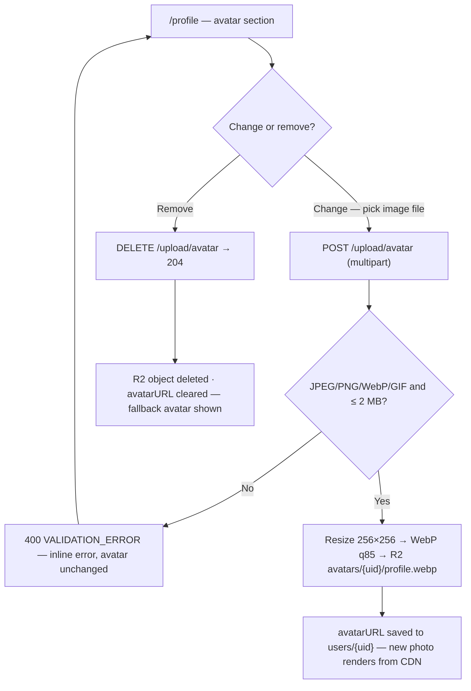
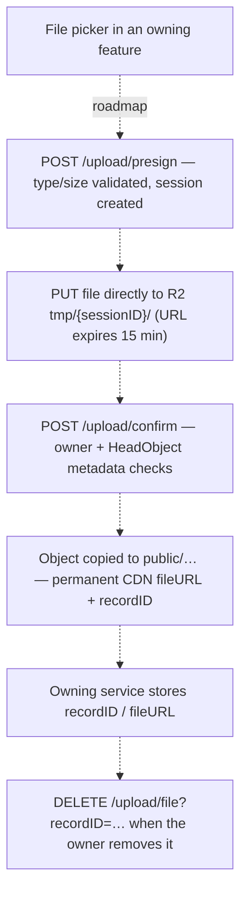
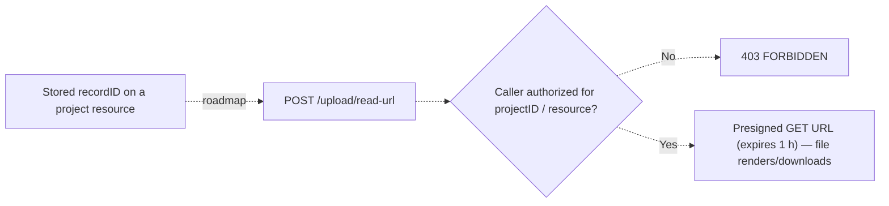

# Upload Service — User Journeys

How each app's users move through the upload flows. See [README.md](./README.md) for the
design spec and [feature-spec.md](./feature-spec.md) for the formal contracts.

> Reflects what is **built today** — the avatar journey (Phase 1) is fully shipped; the
> attachment journeys (Phases 2–3) are roadmap only and shown dashed.

---

## Table of Contents

- [Factory operator — changing the profile photo](#factory-operator--changing-the-profile-photo)
- [Authenticated user — attaching a public file (roadmap)](#authenticated-user--attaching-a-public-file-roadmap)
- [Project member — private file access (roadmap)](#project-member--private-file-access-roadmap)

---

## Factory operator — changing the profile photo

A signed-in operator uploads or removes their avatar from the profile page; the backend
owns validation, image processing, and the Firestore `avatarURL` write.

**Guard(s):** Firebase Bearer token (`FirebaseAuth` middleware); the UID comes from
`middleware.GetUID(r)`, so a caller can only ever touch their own `avatars/{uid}/` object.
The resulting CDN URL is opaque but not access-controlled (same model as Slack/GitHub
avatars). Detail in [avatar-upload.md](./avatar-upload.md).

---

## Authenticated user — attaching a public file (roadmap)

Phase 2 — not built. Large files go directly from the browser to R2 via a presigned PUT
URL, so bytes never pass through the backend.

**Guard(s):** Bearer token on presign/confirm/delete; `confirm` verifies
`callerUID == session.ownerUID` (blocks session hijacking); delete requires record
ownership. Detail in [presign-flow.md](./presign-flow.md).

---

## Project member — private file access (roadmap)

Phase 3 — not built. Private objects live in a bucket with no CDN exposure; every read is
an authorization check.

**Guard(s):** Bearer token + project/resource authorization checked server-side before any
URL is issued; private deletes limited to the uploader or project roles `manager` /
`system_admin` / `owner`. Detail in [presign-flow.md](./presign-flow.md).

---

*See [README.md](./README.md) for the feature spec.*

---

*Version: 1.0.0*
*Last updated: 3 July 2026*
