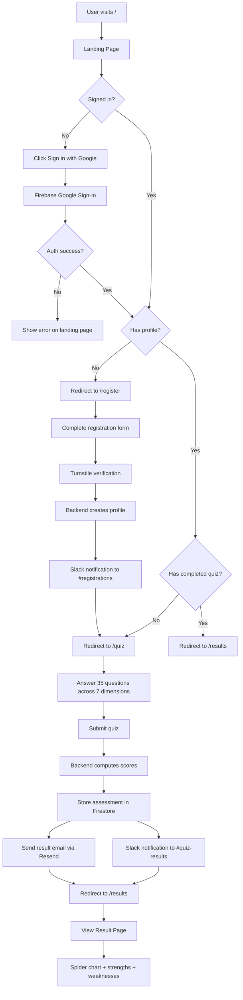
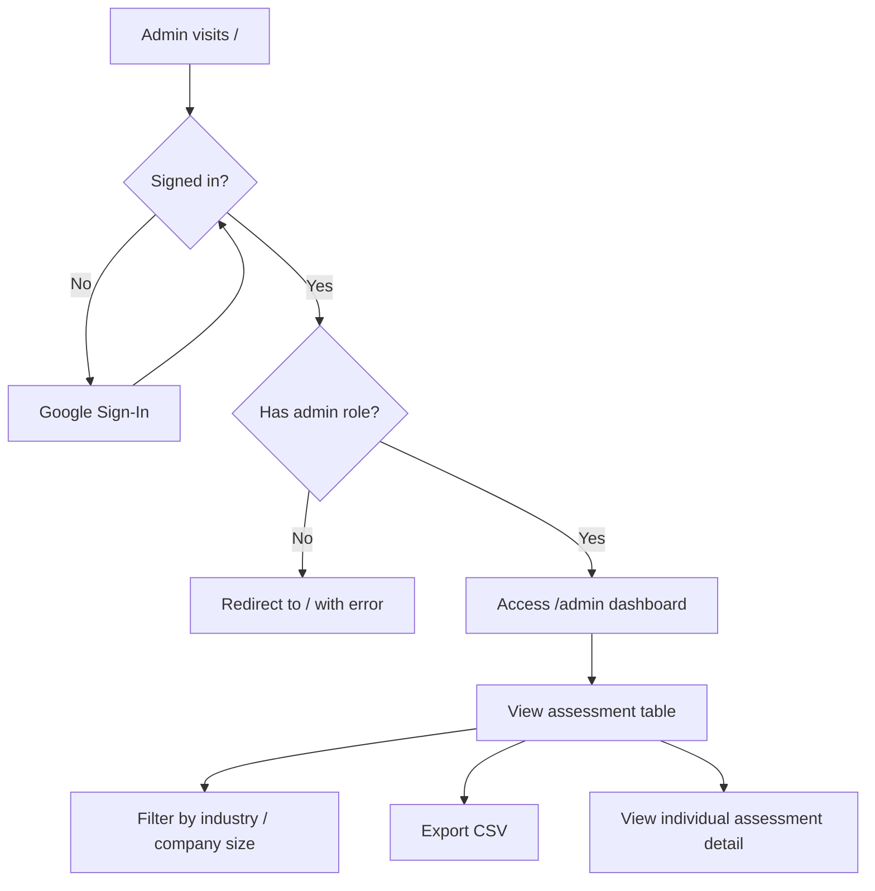
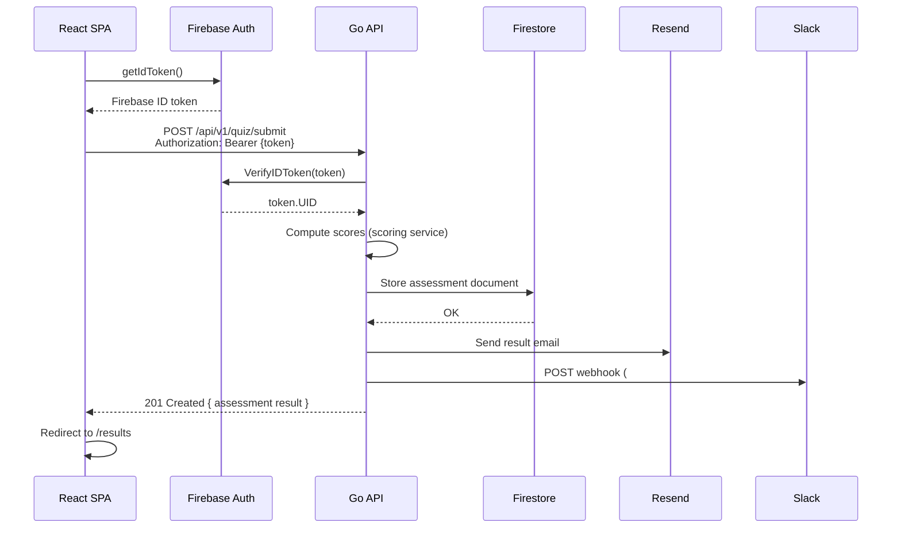
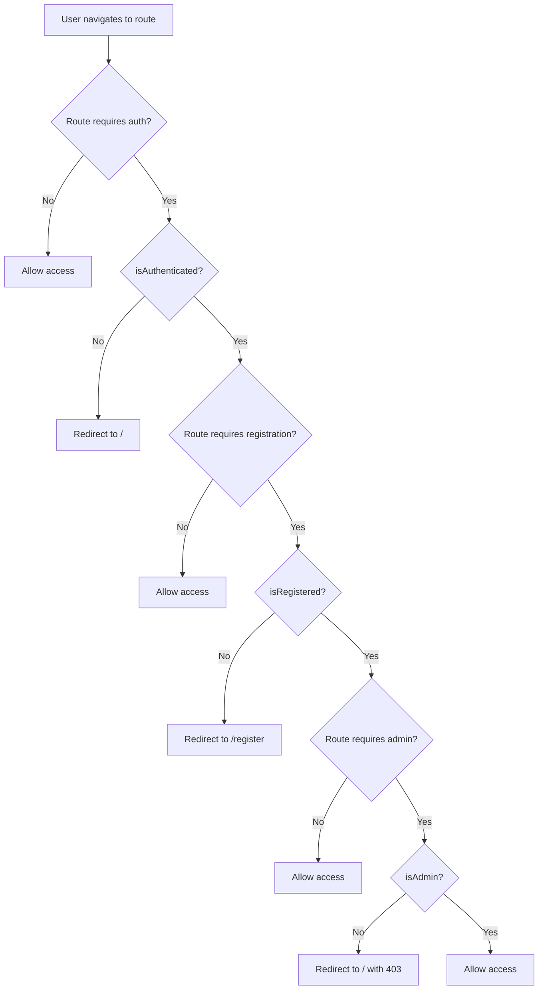
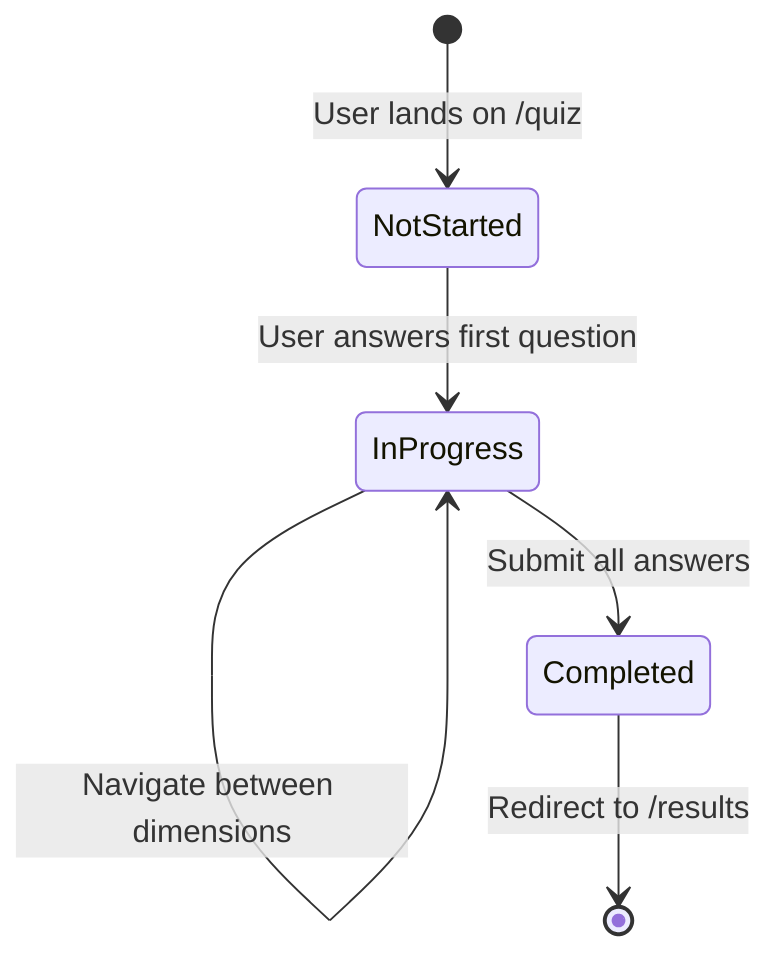
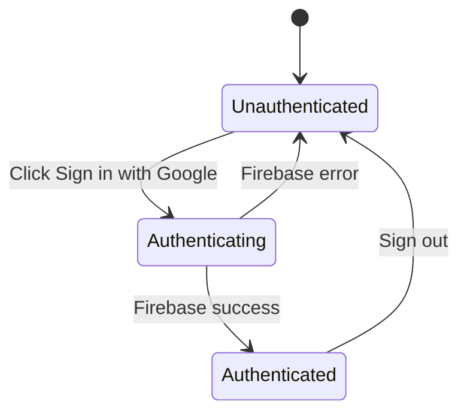

# User Flow

## Main User Journey

## Admin Flow

## API Request Flow (Quiz Submission)

## Route Guard Logic

### Route Protection Map

| Route | Auth | Registered | Admin |
|-------|------|-----------|-------|
| `/` | - | - | - |
| `/register` | Required | - | - |
| `/quiz` | Required | Required | - |
| `/results` | Required | Required | - |
| `/profile` | Required | Required | - |
| `/admin` | Required | Required | Required |

## State Transitions

### Quiz State

### Authentication State

---

## Changelog

| Version | Date | Description |
|---------|------|-------------|
| 1.0.0 | 2026-03-06 | Initial version |
| 1.1.0 | 2026-03-07 | Fix route names (/result -> /results), remove /auth route, add /profile route, fix redirect targets |
