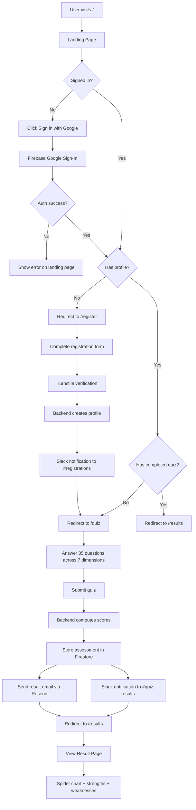
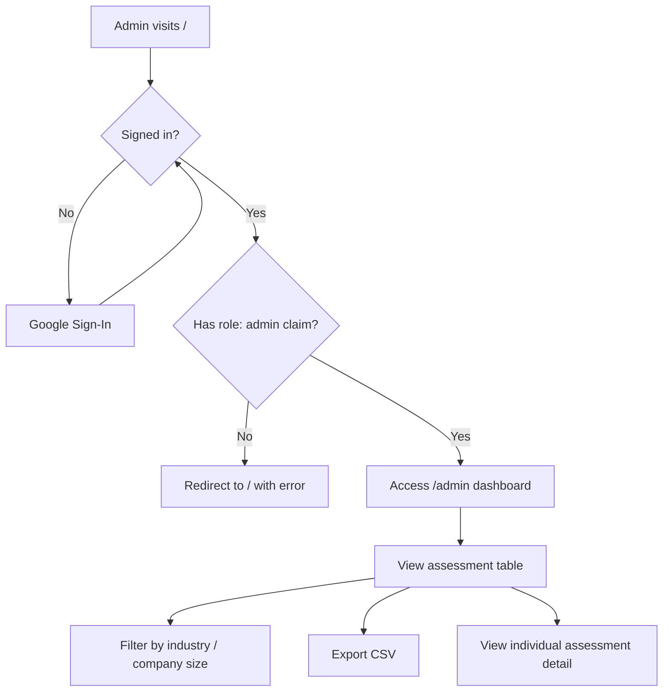
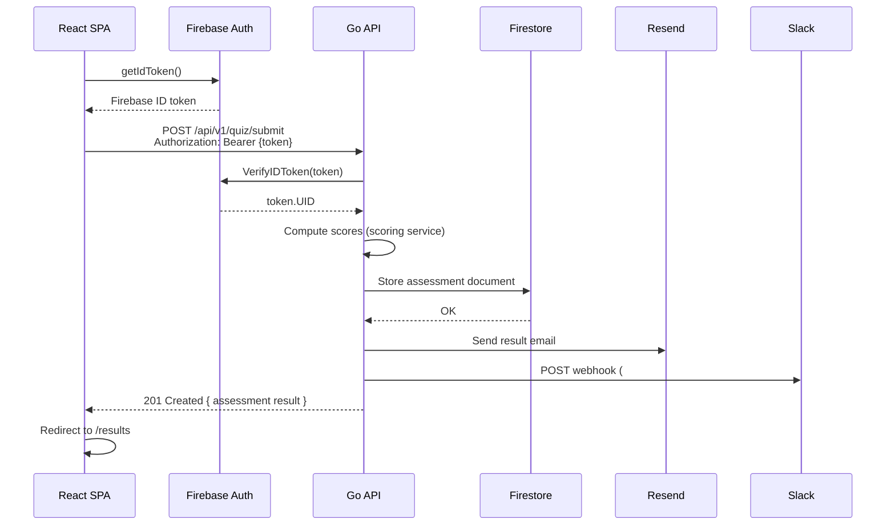
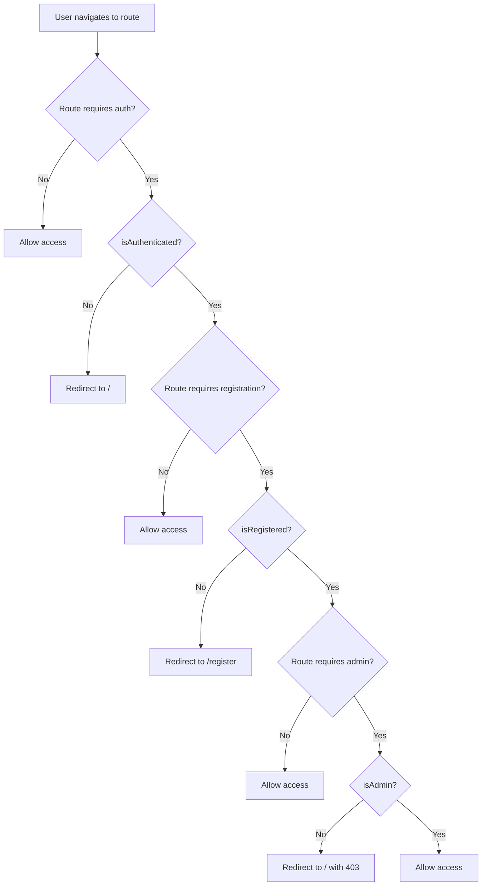
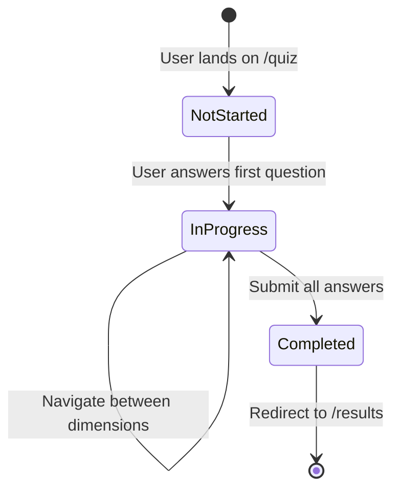
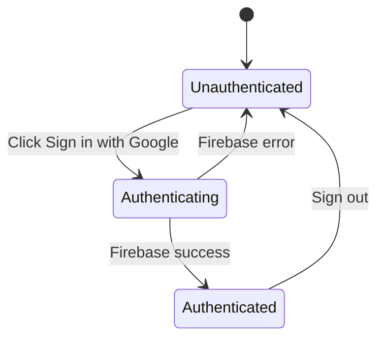

# User Flow

## Main User Journey



## In-App Admin Flow (`fs-app-web` — `role == "admin"`)

> This is the `/admin` route inside `fs-app-web` for users with the `role: "admin"` Firebase custom claim.
> For the dedicated FactorySync staff portal see **Backoffice Staff Flow** below.



## Backoffice Staff Flow (`fs-backoffice-web` — `backofficeRole` claim)

> Separate app at `backoffice.factorysync.com` for FactorySync internal staff.
> Uses a distinct Firebase custom claim (`backofficeRole: "staff"` or `"superadmin"`) —
> not the same as the user-facing `role: "admin"` claim.

```mermaid
flowchart TD
    A[Staff visits backoffice.factorysync.com] --> B{Signed in?}
    B -- No --> C[Redirect to /sign-in]
    C --> D[Google Sign-In]
    D --> B
    B -- Yes --> E{Has backofficeRole claim?}
    E -- No --> F[Redirect to /unauthorized]
    E -- staff --> G[Land on /dashboard]
    E -- superadmin --> G

    G --> H[View stats: projects / users / avg score / staff]
    G --> I[View recent quiz results table]

    G --> J[Navigate via sidebar]
    J --> K[/projects — list, create, search]
    K --> L[/projects/:id — Members tab]
    L --> M[Invite owner]
    L --> N[Change member role]
    L --> O[Remove member]
    K --> P[/projects/:id — Settings tab]
    P --> Q[Edit name / industry / size]

    J --> R[/users — list all users]
    R --> S[View user detail dialog]
    R --> T[Delete user — superadmin only]

    J --> U[/results — all quiz results]
    U --> V[Expand row for dimension detail]
    U --> W[Export CSV]

    J --> X[/staff — superadmin only]
    X --> Y[Add staff by Firebase UID]
    X --> Z[Change staff role]
    X --> AA[Revoke staff access]
```

## API Request Flow (Quiz Submission)



## Route Guard Logic



### Route Protection Map — `fs-app-web`

| Route | Auth | Registered | Admin (`role`) |
|-------|------|-----------|---------------|
| `/` | - | - | - |
| `/register` | Required | - | - |
| `/quiz` | Required | Required | - |
| `/results` | Required | Required | - |
| `/profile` | Required | Required | - |
| `/dashboard` | Required | Required | - |
| `/admin` | Required | Required | Required |

### Route Protection Map — `fs-backoffice-web`

| Route | Auth | `backofficeRole` claim | Superadmin only |
|-------|------|----------------------|-----------------|
| `/sign-in` | - | - | - |
| `/unauthorized` | - | - | - |
| `/dashboard` | Required | `staff` or `superadmin` | - |
| `/projects` | Required | `staff` or `superadmin` | - |
| `/projects/:id` | Required | `staff` or `superadmin` | - |
| `/users` | Required | `staff` or `superadmin` | - |
| `/results` | Required | `staff` or `superadmin` | - |
| `/staff` | Required | `staff` or `superadmin` | Required |

## State Transitions

### Quiz State



### Authentication State



---

## Changelog

| Version | Date | Description |
|---------|------|-------------|
| 1.0.0 | 2026-03-06 | Initial version |
| 1.1.0 | 2026-03-07 | Fix route names (/result -> /results), remove /auth route, add /profile route, fix redirect targets |
| 1.2.0 | 2026-06-11 | Add backoffice staff flow diagram; split route-protection table per app; distinguish `role: "admin"` from `backofficeRole` claim |
